# 📚 DOKUMENTASI LENGKAP
## Sistem Informasi Booking Lapangan Online (Danzyy Field)

---

## 📋 Daftar Isi

1. [Pendahuluan](#1-pendahuluan)
2. [Teknologi yang Digunakan](#2-teknologi-yang-digunakan)
3. [Struktur Folder Proyek](#3-struktur-folder-proyek)
4. [Perancangan Sistem (UML)](#4-perancangan-sistem-uml)
5. [Struktur Database](#5-struktur-database)
6. [Panduan Instalasi](#6-panduan-instalasi)
7. [Screenshot Aplikasi](#7-screenshot-aplikasi)
8. [Pengujian Sistem (Testing)](#8-pengujian-sistem-testing)
9. [API Endpoints](#9-api-endpoints)
10. [Akun Default](#10-akun-default)

---

## 1. Pendahuluan

### 1.1 Deskripsi Sistem
**Danzyy Field** adalah sistem informasi booking lapangan olahraga berbasis web yang memungkinkan pengguna untuk melakukan reservasi secara online. Aplikasi dibangun menggunakan teknologi modern dengan arsitektur full-stack.

### 1.2 Latar Belakang
Proses reservasi lapangan olahraga secara konvensional memiliki beberapa masalah:
- Pelanggan harus datang langsung atau menelepon untuk cek jadwal
- Rentan terjadi kesalahan pencatatan (human error)
- Potensi jadwal ganda (double booking)
- Rekapitulasi keuangan sulit dan berpotensi selisih

### 1.3 Tujuan
1. Mendigitalisasi proses reservasi lapangan olahraga
2. Mencegah double booking dengan validasi otomatis
3. Mempermudah pengelola dalam rekapitulasi pendapatan

### 1.4 Role Pengguna

| Role | Hak Akses |
|------|-----------|
| **ADMIN** | Kelola lapangan, pengguna, lihat laporan & statistik |
| **STAFF** | Verifikasi pembayaran, lihat jadwal booking |
| **CUSTOMER** | Booking lapangan, upload bukti bayar, lihat riwayat |

---

## 2. Teknologi yang Digunakan

### 2.1 Tech Stack

| Kategori | Teknologi | Versi |
|----------|-----------|-------|
| Framework | Next.js (App Router) | 16.0.7 |
| UI Library | React | 19.2.0 |
| Language | TypeScript | ^5 |
| Styling | Tailwind CSS | 3.4 |
| Database | MySQL | - |
| ORM | Prisma | ^6.19.0 |
| Auth | JWT (jose) | ^6.1.3 |
| Icon | Lucide React | ^0.556.0 |
| Image Storage | Cloudinary | ^2.8.0 |
| Password Hash | bcryptjs | ^3.0.3 |

---

## 3. Struktur Folder Proyek

```
booking-lapangan-v2/
├── 📁 prisma/                    # Database Schema & Seeding
│   ├── schema.prisma             # Definisi model database
│   └── seed.ts                   # Data awal
│
├── 📁 src/                       # Source Code
│   ├── 📁 app/                   # Next.js App Router
│   │   ├── (auth)/               # Login & Register
│   │   ├── (dashboard)/          # Dashboard per Role
│   │   │   ├── admin/            # Halaman Admin
│   │   │   ├── staff/            # Halaman Staff
│   │   │   └── customer/         # Halaman Customer
│   │   └── api/                  # REST API Routes
│   │
│   ├── 📁 components/            # Komponen UI
│   ├── 📁 hooks/                 # Custom Hooks
│   ├── 📁 lib/                   # Utilities
│   └── middleware.ts             # Route Protection
│
├── 📁 Dokumentasi/               # Dokumentasi Proyek
│   └── Picture/                  # Screenshot Aplikasi
│
├── .env                          # Environment Variables
├── package.json                  # Dependencies
└── tailwind.config.js            # Tailwind Config
```

---

## 4. Perancangan Sistem (UML)

### 4.1 Use Case Diagram
Diagram berikut menggambarkan interaksi antara aktor (Customer, Staff, Admin) dengan sistem.

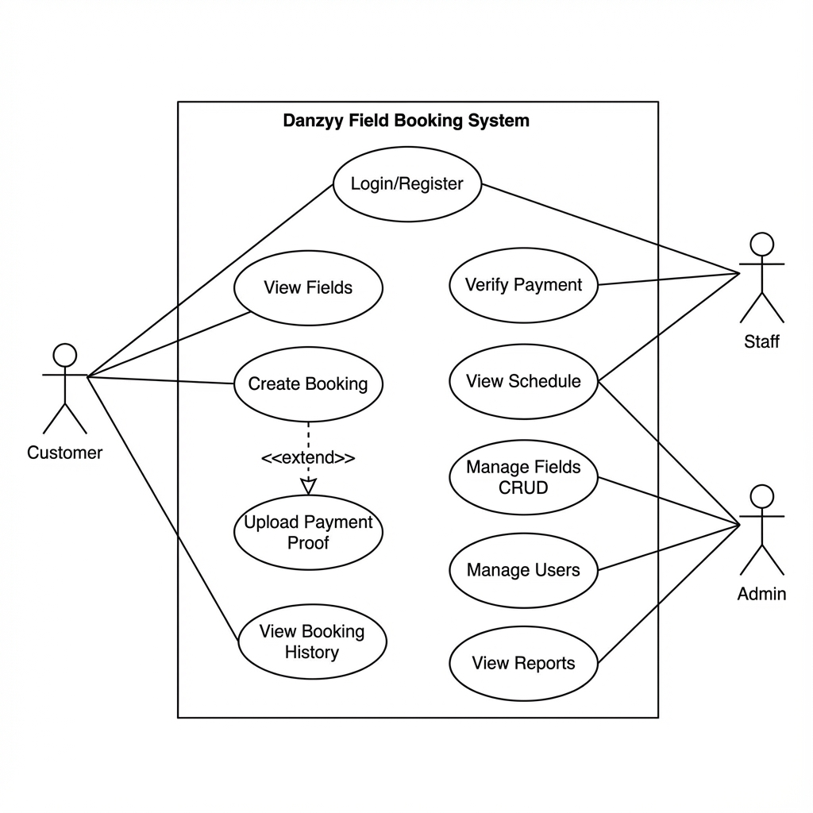

**Gambar 4.1** Use Case Diagram Sistem Booking Lapangan - Menampilkan interaksi Customer (booking, bayar), Staff (verifikasi), dan Admin (kelola sistem)

### 4.2 Activity Diagram (Alur Booking)
Diagram aktivitas menjelaskan alur proses pemesanan lapangan dari awal hingga selesai.

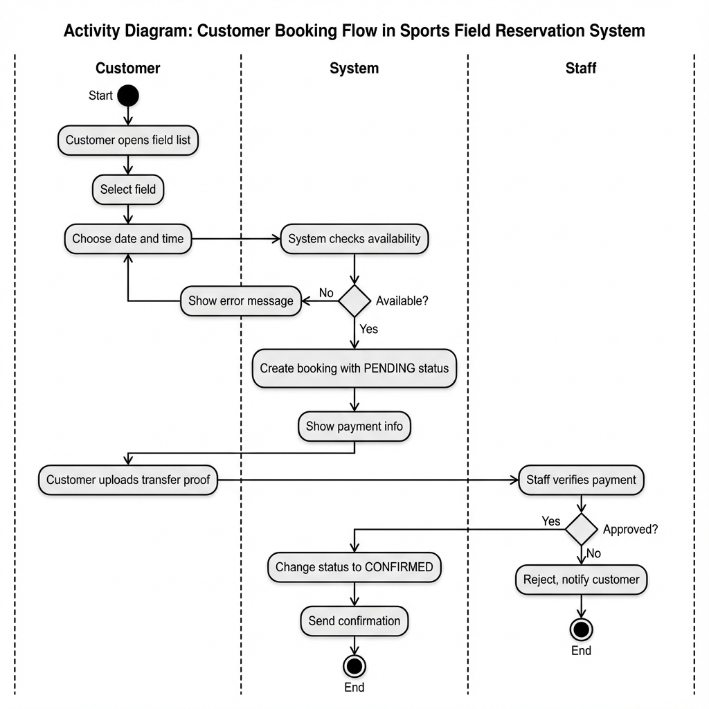

**Gambar 4.2** Activity Diagram Proses Booking - Menampilkan alur dari login, pilih lapangan, pilih jadwal, bayar, hingga verifikasi

### 4.3 Class Diagram
Diagram kelas menggambarkan struktur objek dan relasi antar class dalam sistem.

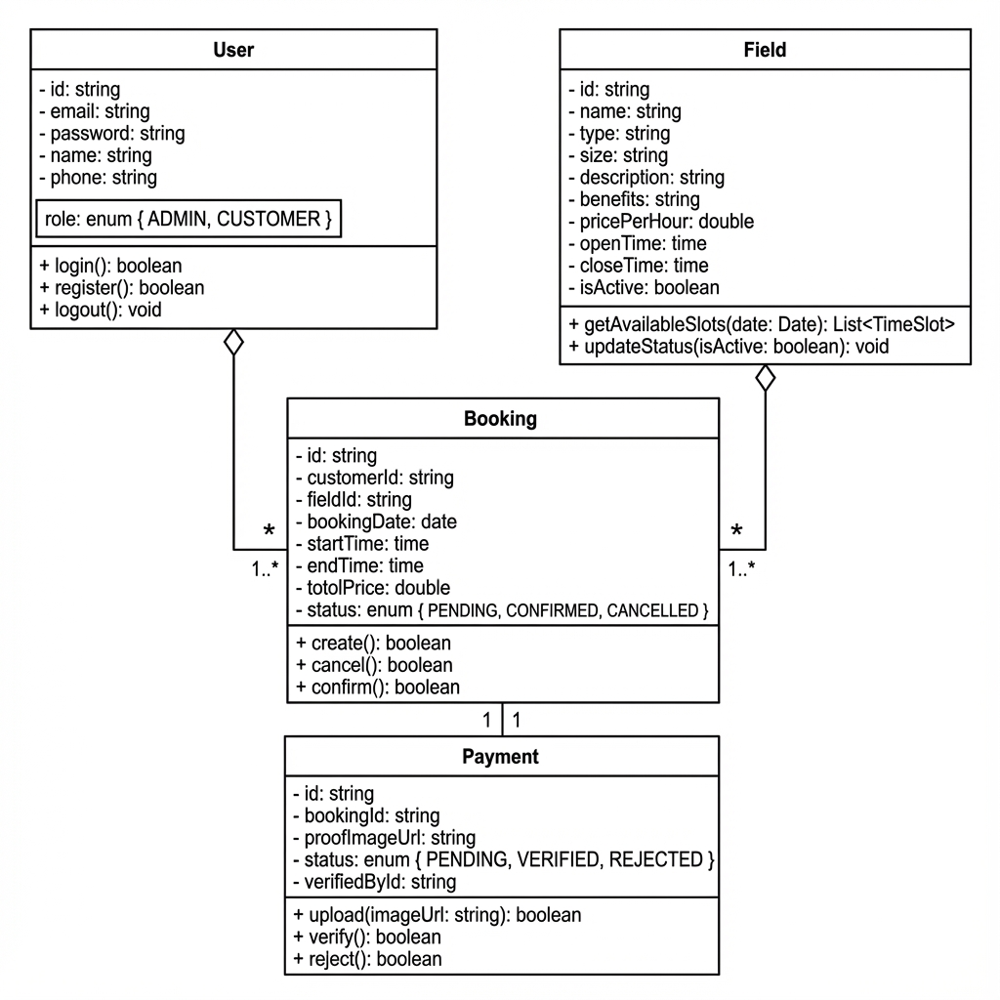

**Gambar 4.3** Class Diagram Sistem - Menampilkan class User, Field, Booking, Payment beserta atribut dan relasinya

---

## 5. Struktur Database

### 5.1 Entity Relationship Diagram (ERD)


**Gambar 5.1** Entity Relationship Diagram - Menampilkan relasi antar tabel users, fields, bookings, dan payments

### 5.2 Daftar Tabel

| Tabel | Deskripsi | Kolom Utama |
|-------|-----------|-------------|
| `users` | Data pengguna | id, email, password, name, phone, role |
| `fields` | Data lapangan | id, name, type, size, pricePerHour, openTime, closeTime |
| `field_images` | Gambar lapangan | id, fieldId, imageUrl, order |
| `bookings` | Data pemesanan | id, customerId, fieldId, bookingDate, startTime, endTime, totalPrice, status |
| `payments` | Data pembayaran | id, bookingId, proofImageUrl, status, verifiedById |

### 5.3 Enum Values

| Enum | Values |
|------|--------|
| Role | `ADMIN`, `STAFF`, `CUSTOMER` |
| BookingStatus | `PENDING`, `CONFIRMED`, `CANCELLED`, `COMPLETED` |
| PaymentStatus | `PENDING`, `VERIFIED`, `REJECTED` |

---

## 6. Panduan Instalasi

### 6.1 Prasyarat
- Node.js v18+
- MySQL Server (XAMPP/Laragon)
- Git

### 6.2 Langkah Instalasi

```bash
# Clone & Install
git clone <repository-url>
cd booking-lapangan-v2
npm install

# Konfigurasi .env
DATABASE_URL="mysql://root:@localhost:3306/danzyy_field"
JWT_SECRET="your-secret-key"
NEXT_PUBLIC_CLOUDINARY_CLOUD_NAME="your-cloudinary"
CLOUDINARY_API_KEY="your-api-key"
CLOUDINARY_API_SECRET="your-api-secret"

# Setup Database
npm run db:push
npm run db:seed

# Jalankan
npm run dev
```

Akses: `http://localhost:3000`

---

## 7. Screenshot Aplikasi

### 7.1 Halaman Publik

#### Landing Page


**Gambar 7.1** Landing Page - Halaman awal website yang menampilkan informasi umum dan tombol login/register

#### Halaman Login


**Gambar 7.2** Halaman Login - Form login dengan input email dan password

#### Halaman Register
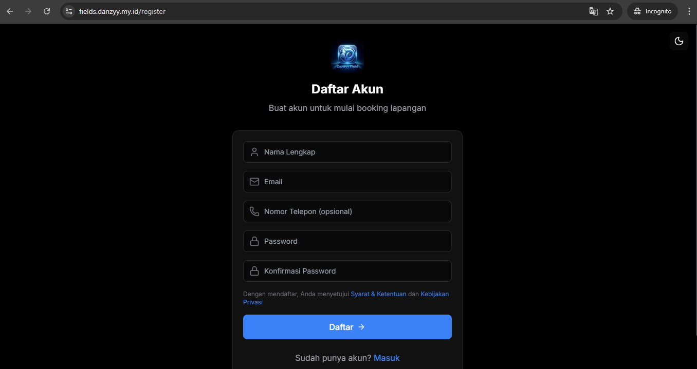

**Gambar 7.3** Halaman Register - Form pendaftaran akun baru untuk customer

---

### 7.2 Dashboard Admin

#### Dashboard Admin
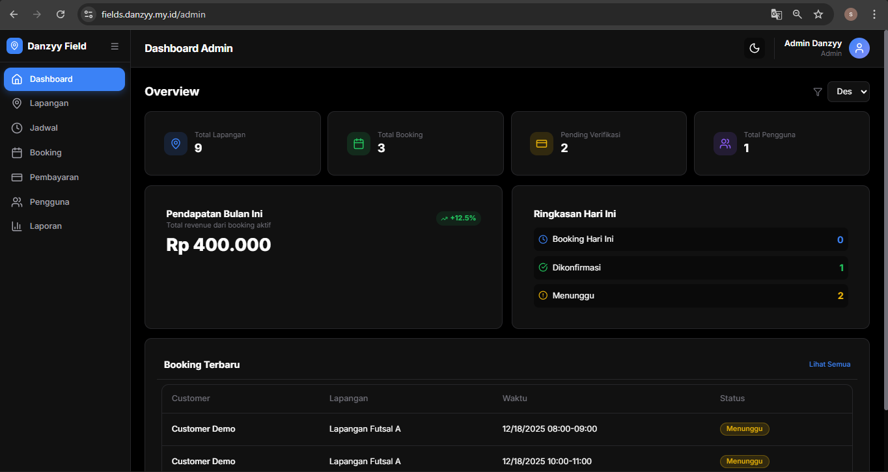

**Gambar 7.4** Dashboard Admin - Menampilkan statistik booking, pendapatan, dan grafik

#### Kelola Lapangan
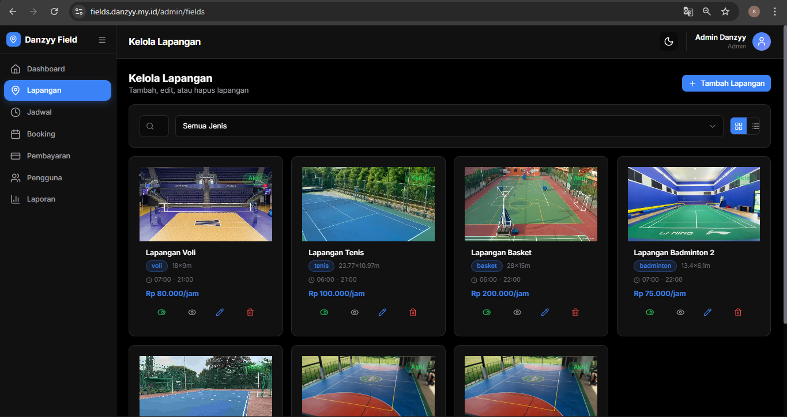

**Gambar 7.5** Halaman Kelola Lapangan - Daftar lapangan dengan opsi tambah, edit, dan hapus

#### Daftar Booking


**Gambar 7.6** Halaman Daftar Booking - Tabel semua booking dengan filter dan status

#### Detail Booking
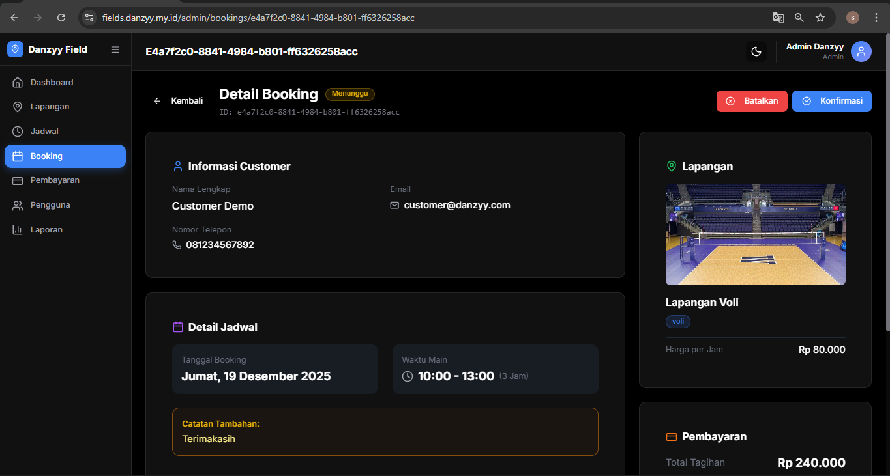

**Gambar 7.7** Detail Booking - Informasi lengkap booking termasuk customer, lapangan, dan pembayaran

#### Detail Booking Approved
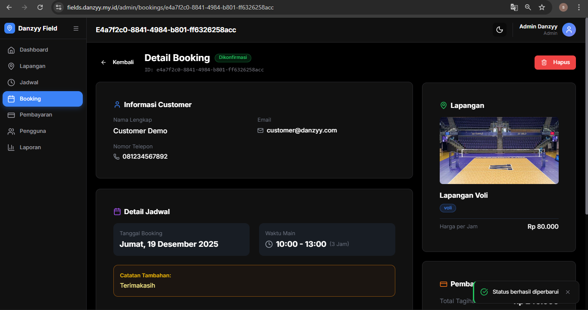

**Gambar 7.8** Detail Booking Setelah Diapprove - Status booking berubah menjadi CONFIRMED

#### Jadwal Lapangan Admin


**Gambar 7.9** Monitor Jadwal Lapangan - Tampilan grid jadwal harian dengan slot tersedia dan terboking

#### Kelola Pengguna
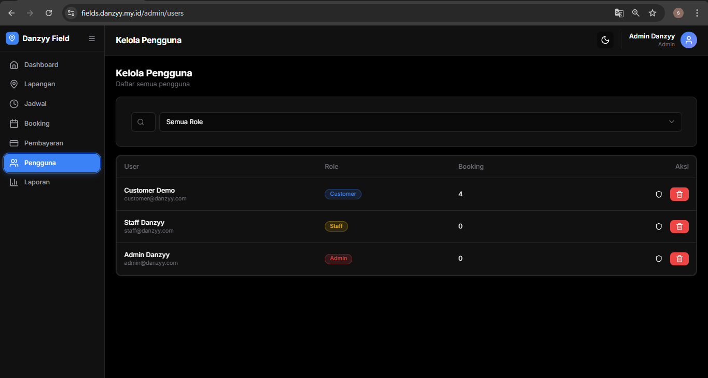

**Gambar 7.10** Halaman Kelola Pengguna - Daftar user dengan opsi ubah role dan hapus

#### Daftar Pembayaran


**Gambar 7.11** Halaman Daftar Pembayaran - Tabel pembayaran dengan status verifikasi

#### Bukti Transfer
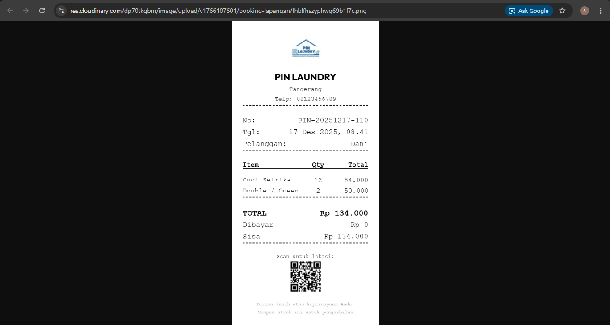

**Gambar 7.12** Modal Bukti Transfer - Preview gambar bukti pembayaran yang diupload customer

#### Laporan Pendapatan


**Gambar 7.13** Halaman Laporan - Rekap pendapatan per periode dengan grafik

---

### 7.3 Dashboard Staff

#### Dashboard Staff
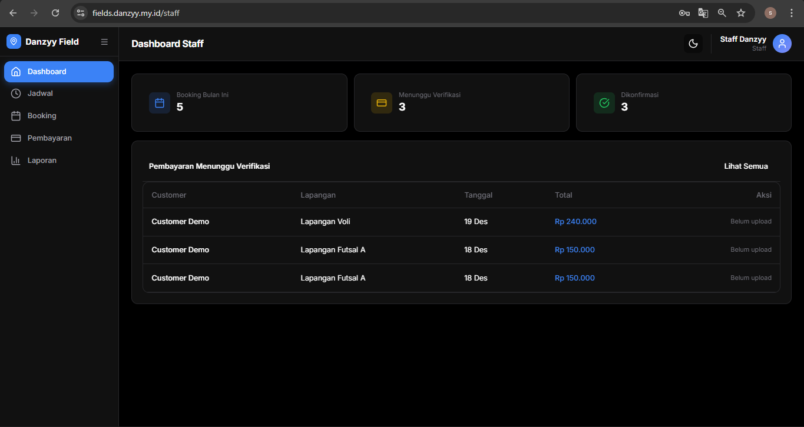

**Gambar 7.14** Dashboard Staff - Tampilan ringkas jadwal hari ini dan booking yang perlu diverifikasi

---

### 7.4 Dashboard Customer

#### Dashboard Customer
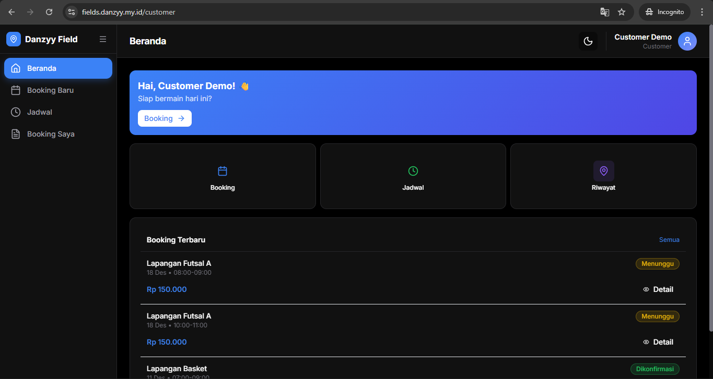

**Gambar 7.15** Dashboard Customer - Menampilkan daftar lapangan tersedia dan booking terakhir

#### Form Booking - Pilih Lapangan


**Gambar 7.16** Form Booking Langkah 1 - Pilih lapangan yang ingin dipesan

#### Form Booking - Pilih Jadwal
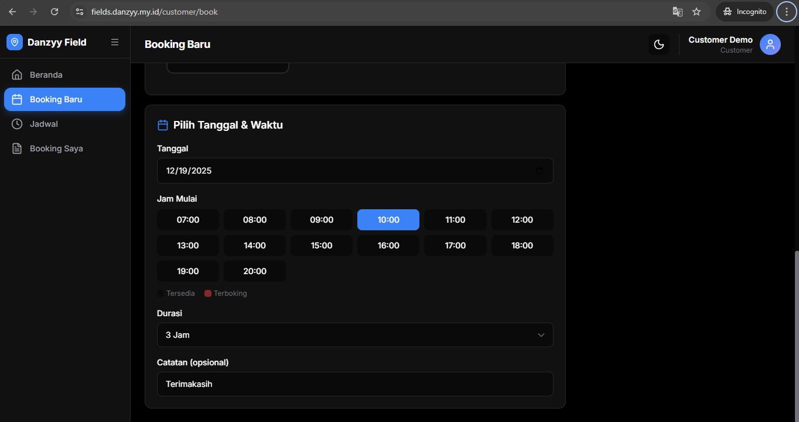

**Gambar 7.17** Form Booking Langkah 2 - Pilih tanggal dan jam yang tersedia

#### Riwayat Booking
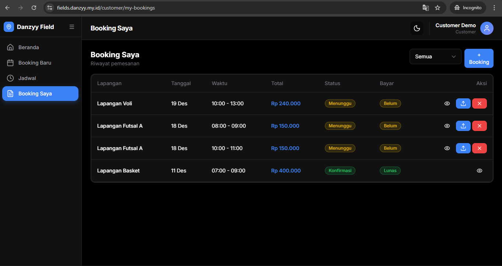

**Gambar 7.18** Halaman Booking Saya - Daftar riwayat booking customer dengan status masing-masing

#### Detail Booking Customer


**Gambar 7.19** Detail Booking Customer - Informasi booking dan tombol upload bukti pembayaran

#### Upload Bukti Pembayaran
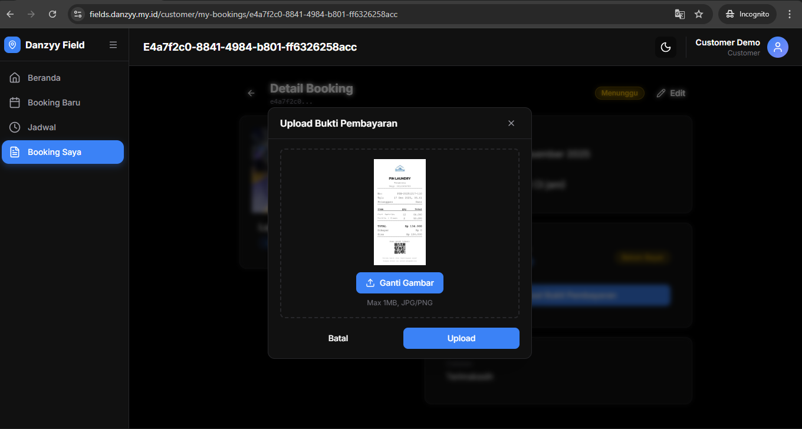

**Gambar 7.20** Modal Upload Bukti Bayar - Form upload gambar bukti transfer

#### Jadwal Customer (Pending)


**Gambar 7.21** Jadwal Lapangan Customer - Menampilkan slot yang sudah dipesan (pending approval)

---

## 8. Pengujian Sistem (Testing)

### 8.1 Black Box Testing

#### Autentikasi

| No | Skenario | Input | Hasil Harapan | Status |
|----|----------|-------|---------------|--------|
| 1 | Login valid | Email & password benar | Masuk dashboard | ✅ |
| 2 | Login invalid | Password salah | Alert error | ✅ |
| 3 | Register baru | Data valid | Akun terbuat | ✅ |
| 4 | Register duplikat | Email sudah ada | Alert error | ✅ |

#### Booking

| No | Skenario | Input | Hasil Harapan | Status |
|----|----------|-------|---------------|--------|
| 5 | Booking tersedia | Jam kosong | Booking berhasil | ✅ |
| 6 | Booking bentrok | Jam sudah terisi | Ditolak | ✅ |
| 7 | Booking di luar jam | Jam tutup | Tidak bisa pilih | ✅ |
| 8 | Cancel booking | Klik cancel | Status CANCELLED | ✅ |
| 9 | Booking jam terlewat | Jam sudah lewat | Ditolak | ✅ |

#### Pembayaran

| No | Skenario | Input | Hasil Harapan | Status |
|----|----------|-------|---------------|--------|
| 10 | Upload bukti | File JPG/PNG | Tersimpan | ✅ |
| 11 | Upload invalid | File PDF | Ditolak | ✅ |
| 12 | Approve payment | Klik approve | Status VERIFIED | ✅ |
| 13 | Reject payment | Klik reject | Status REJECTED | ✅ |

#### CRUD Lapangan (Admin)

| No | Skenario | Input | Hasil Harapan | Status |
|----|----------|-------|---------------|--------|
| 14 | Tambah lapangan | Data valid | Data tersimpan | ✅ |
| 15 | Edit lapangan | Ubah harga | Data terupdate | ✅ |
| 16 | Hapus lapangan | Klik delete | Data terhapus | ✅ |
| 17 | Nonaktifkan | Toggle off | Tersembunyi | ✅ |

#### Keamanan

| No | Skenario | Input | Hasil Harapan | Status |
|----|----------|-------|---------------|--------|
| 18 | Akses tanpa login | URL /admin | Redirect login | ✅ |
| 19 | Customer ke admin | URL /admin | Access denied | ✅ |
| 20 | Staff ke CRUD | URL /admin/fields | Access denied | ✅ |

### 8.2 Ringkasan

| Kategori | Total | Passed | Persentase |
|----------|-------|--------|------------|
| Autentikasi | 4 | 4 | 100% |
| Booking | 5 | 5 | 100% |
| Pembayaran | 4 | 4 | 100% |
| CRUD | 4 | 4 | 100% |
| Keamanan | 3 | 3 | 100% |
| **TOTAL** | **20** | **20** | **100%** |

---

## 9. API Endpoints

### Authentication
| Method | Endpoint | Deskripsi |
|--------|----------|-----------|
| POST | `/api/auth/login` | Login |
| POST | `/api/auth/register` | Register |
| POST | `/api/auth/logout` | Logout |
| GET | `/api/auth/me` | User info |

### Fields
| Method | Endpoint | Deskripsi |
|--------|----------|-----------|
| GET | `/api/fields` | List lapangan |
| GET | `/api/fields/[id]` | Detail lapangan |
| POST | `/api/fields` | Tambah (Admin) |
| PUT | `/api/fields/[id]` | Update (Admin) |
| DELETE | `/api/fields/[id]` | Hapus (Admin) |

### Bookings
| Method | Endpoint | Deskripsi |
|--------|----------|-----------|
| GET | `/api/bookings` | List booking |
| POST | `/api/bookings` | Buat booking |
| PUT | `/api/bookings/[id]` | Update status |
| GET | `/api/schedule` | Cek jadwal lapangan |

### Payments
| Method | Endpoint | Deskripsi |
|--------|----------|-----------|
| GET | `/api/payments` | List pembayaran |
| PUT | `/api/payments/[id]` | Upload bukti / Verifikasi |

### Users
| Method | Endpoint | Deskripsi |
|--------|----------|-----------|
| GET | `/api/users` | List user (Admin) |
| PUT | `/api/users/[id]` | Update user |
| DELETE | `/api/users/[id]` | Hapus (Admin) |

---

## 10. Akun Default

Setelah `npm run db:seed`:

| Role | Email | Password |
|------|-------|----------|
| Admin | admin@danzyy.com | admin123 |
| Staff | staff@danzyy.com | staff123 |
| Customer | customer@danzyy.com | customer123 |

---

## 📝 NPM Scripts

| Script | Fungsi |
|--------|--------|
| `npm run dev` | Development server |
| `npm run build` | Build production |
| `npm run db:push` | Push schema ke DB |
| `npm run db:seed` | Seed data awal |
| `npm run db:studio` | Prisma Studio GUI |

---

## Daftar Nama File Gambar

Silakan rename file gambar sesuai tabel berikut:

| No | Nama File Baru | Caption | File Lama |
|----|----------------|---------|-----------|
| 4.1 | `gambar_4_1_usecase_diagram.png` | Use Case Diagram Sistem Booking Lapangan | `usecase_diagram.png` |
| 4.2 | `gambar_4_2_activity_diagram.png` | Activity Diagram Proses Booking | `activity_diagram.png` |
| 4.3 | `gambar_4_3_class_diagram.png` | Class Diagram Sistem | `class_diagram.png` |
| 5.1 | `gambar_5_1_erd_diagram.png` | Entity Relationship Diagram | `erd_diagram.png` |
| 7.1 | `gambar_7_1_landing_page.png` | Landing Page | `Menu awal.png` |
| 7.2 | `gambar_7_2_halaman_login.png` | Halaman Login | `login.png` |
| 7.3 | `gambar_7_3_halaman_register.png` | Halaman Register | `register.png` |
| 7.4 | `gambar_7_4_dashboard_admin.png` | Dashboard Admin | `Admin/Dashboard.png` |
| 7.5 | `gambar_7_5_kelola_lapangan.png` | Halaman Kelola Lapangan | `Admin/lapangan.png` |
| 7.6 | `gambar_7_6_daftar_booking.png` | Halaman Daftar Booking | `Admin/booking.png` |
| 7.7 | `gambar_7_7_detail_booking.png` | Detail Booking | `Admin/detai booking.png` |
| 7.8 | `gambar_7_8_booking_approved.png` | Detail Booking Setelah Diapprove | `Admin/booking acc.png` |
| 7.9 | `gambar_7_9_jadwal_admin.png` | Monitor Jadwal Lapangan | `Admin/jadwal booking jika sudah di acc.png` |
| 7.10 | `gambar_7_10_kelola_pengguna.png` | Halaman Kelola Pengguna | `Admin/kelola pengguna.png` |
| 7.11 | `gambar_7_11_daftar_pembayaran.png` | Halaman Daftar Pembayaran | `Admin/pembayaran.png` |
| 7.12 | `gambar_7_12_bukti_transfer.png` | Modal Bukti Transfer | `Admin/contoh bukti transfer yang sdah di upload.png` |
| 7.13 | `gambar_7_13_laporan_pendapatan.png` | Halaman Laporan | `Admin/laporan.png` |
| 7.14 | `gambar_7_14_dashboard_staff.png` | Dashboard Staff | `Staff/Dashboard.png` |
| 7.15 | `gambar_7_15_dashboard_customer.png` | Dashboard Customer | `customer/dashboard.png` |
| 7.16 | `gambar_7_16_form_booking_pilih_lapangan.png` | Form Booking Langkah 1 | `customer/buat booking 1.png` |
| 7.17 | `gambar_7_17_form_booking_pilih_jadwal.png` | Form Booking Langkah 2 | `customer/buat booking 2.png` |
| 7.18 | `gambar_7_18_riwayat_booking.png` | Halaman Booking Saya | `customer/booking saya.png` |
| 7.19 | `gambar_7_19_detail_booking_customer.png` | Detail Booking Customer | `customer/booking detail.png` |
| 7.20 | `gambar_7_20_upload_bukti.png` | Modal Upload Bukti Bayar | `customer/upload bukti.png` |
| 7.21 | `gambar_7_21_jadwal_pending.png` | Jadwal Lapangan Customer | `customer/jadwal booking jika belum di acc.png` |

---

**Danzyy Field © 2025**

