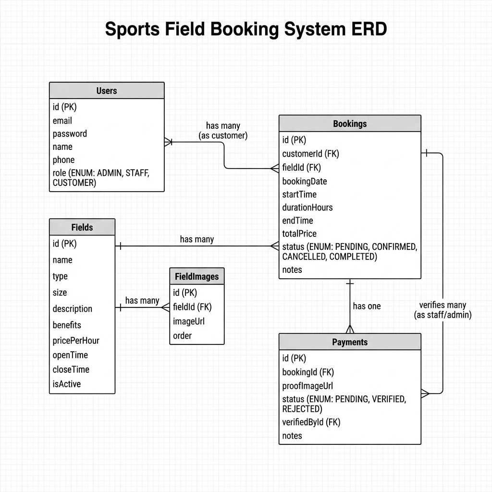
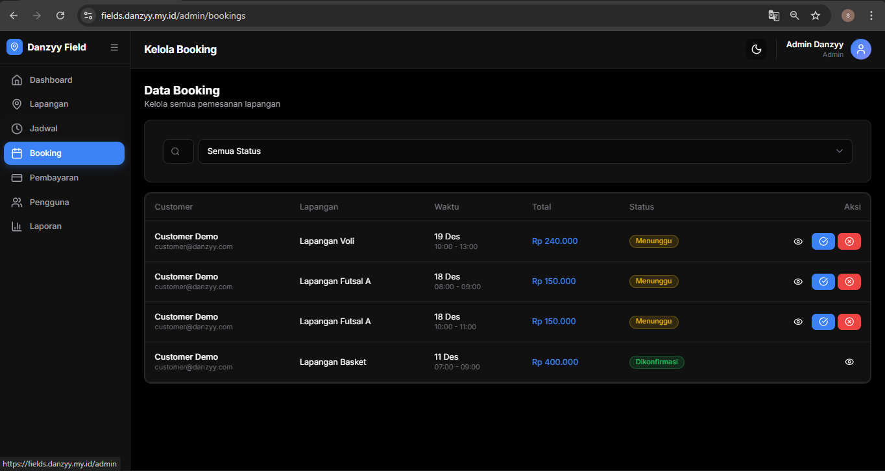
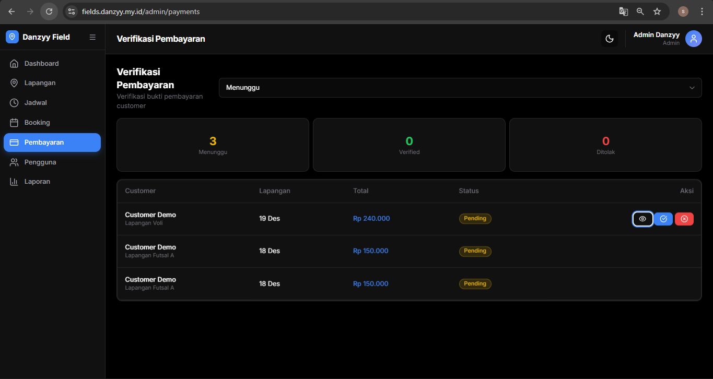
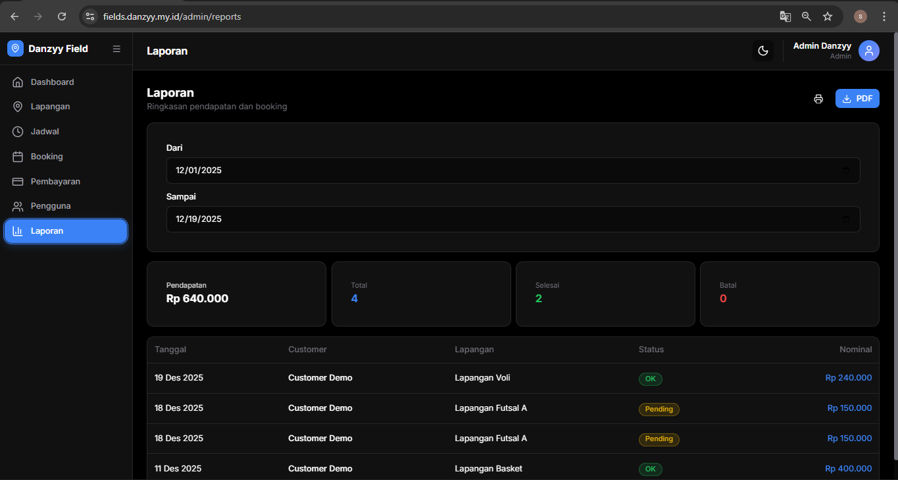

# 📚 DOKUMENTASI LENGKAP
## Sistem Informasi Booking Lapangan Online (Danzyy Field)

---

## 📋 Daftar Isi

1. [Pendahuluan](#1-pendahuluan)
2. [Teknologi yang Digunakan](#2-teknologi-yang-digunakan)
3. [Struktur Folder Proyek](#3-struktur-folder-proyek)
4. [Perancangan Sistem (UML)](#4-perancangan-sistem-uml)
5. [Struktur Database](#5-struktur-database)
6. [Panduan Instalasi](#6-panduan-instalasi)
7. [Screenshot Aplikasi](#7-screenshot-aplikasi)
8. [Pengujian Sistem (Testing)](#8-pengujian-sistem-testing)
9. [API Endpoints](#9-api-endpoints)
10. [Akun Default](#10-akun-default)

---

## 1. Pendahuluan

### 1.1 Deskripsi Sistem
**Danzyy Field** adalah sistem informasi booking lapangan olahraga berbasis web yang memungkinkan pengguna untuk melakukan reservasi secara online. Aplikasi dibangun menggunakan teknologi modern dengan arsitektur full-stack.

### 1.2 Latar Belakang
Proses reservasi lapangan olahraga secara konvensional memiliki beberapa masalah:
- Pelanggan harus datang langsung atau menelepon untuk cek jadwal
- Rentan terjadi kesalahan pencatatan (human error)
- Potensi jadwal ganda (double booking)
- Rekapitulasi keuangan sulit dan berpotensi selisih

### 1.3 Tujuan
1. Mendigitalisasi proses reservasi lapangan olahraga
2. Mencegah double booking dengan validasi otomatis
3. Mempermudah pengelola dalam rekapitulasi pendapatan

### 1.4 Role Pengguna

| Role | Hak Akses |
|------|-----------|
| **ADMIN** | Kelola lapangan, pengguna, lihat laporan & statistik |
| **STAFF** | Verifikasi pembayaran, lihat jadwal booking |
| **CUSTOMER** | Booking lapangan, upload bukti bayar, lihat riwayat |

---

## 2. Teknologi yang Digunakan

### 2.1 Tech Stack

| Kategori | Teknologi | Versi |
|----------|-----------|-------|
| Framework | Next.js (App Router) | 16.0.7 |
| UI Library | React | 19.2.0 |
| Language | TypeScript | ^5 |
| Styling | Tailwind CSS | 3.4 |
| Database | MySQL | - |
| ORM | Prisma | ^6.19.0 |
| Auth | JWT (jose) | ^6.1.3 |
| Icon | Lucide React | ^0.556.0 |
| Image Storage | Cloudinary | ^2.8.0 |
| Password Hash | bcryptjs | ^3.0.3 |

---

## 3. Struktur Folder Proyek

```
booking-lapangan-v2/
├── 📁 prisma/                    # Database Schema & Seeding
│   ├── schema.prisma             # Definisi model database
│   └── seed.ts                   # Data awal
│
├── 📁 src/                       # Source Code
│   ├── 📁 app/                   # Next.js App Router
│   │   ├── (auth)/               # Login & Register
│   │   ├── (dashboard)/          # Dashboard per Role
│   │   │   ├── admin/            # Halaman Admin
│   │   │   ├── staff/            # Halaman Staff
│   │   │   └── customer/         # Halaman Customer
│   │   └── api/                  # REST API Routes
│   │
│   ├── 📁 components/            # Komponen UI
│   ├── 📁 hooks/                 # Custom Hooks
│   ├── 📁 lib/                   # Utilities
│   └── middleware.ts             # Route Protection
│
├── 📁 Dokumentasi/               # Dokumentasi Proyek
│   └── Picture/                  # Screenshot Aplikasi
│
├── .env                          # Environment Variables
├── package.json                  # Dependencies
└── tailwind.config.js            # Tailwind Config
```

---

## 4. Perancangan Sistem (UML)

### 4.1 Use Case Diagram
Diagram berikut menggambarkan interaksi antara aktor (Customer, Staff, Admin) dengan sistem.


*Gambar 4.1: Use Case Diagram Sistem Booking Lapangan*

### 4.2 Activity Diagram (Alur Booking)
Diagram aktivitas menjelaskan alur proses pemesanan lapangan dari awal hingga selesai.


*Gambar 4.2: Activity Diagram Proses Booking*

### 4.3 Class Diagram
Diagram kelas menggambarkan struktur objek dan relasi antar class dalam sistem.


*Gambar 4.3: Class Diagram Sistem*

---

## 5. Struktur Database

### 5.1 Entity Relationship Diagram (ERD)


*Gambar 5.1: Entity Relationship Diagram*

### 5.2 Daftar Tabel

| Tabel | Deskripsi | Kolom Utama |
|-------|-----------|-------------|
| `users` | Data pengguna | id, email, password, name, phone, role |
| `fields` | Data lapangan | id, name, type, size, pricePerHour, openTime, closeTime |
| `field_images` | Gambar lapangan | id, fieldId, imageUrl, order |
| `bookings` | Data pemesanan | id, customerId, fieldId, bookingDate, startTime, endTime, totalPrice, status |
| `payments` | Data pembayaran | id, bookingId, proofImageUrl, status, verifiedById |

### 5.3 Enum Values

| Enum | Values |
|------|--------|
| Role | `ADMIN`, `STAFF`, `CUSTOMER` |
| BookingStatus | `PENDING`, `CONFIRMED`, `CANCELLED`, `COMPLETED` |
| PaymentStatus | `PENDING`, `VERIFIED`, `REJECTED` |

---

## 6. Panduan Instalasi

### 6.1 Prasyarat
- Node.js v18+
- MySQL Server (XAMPP/Laragon)
- Git

### 6.2 Langkah Instalasi

```bash
# Clone & Install
git clone <repository-url>
cd booking-lapangan-v2
npm install

# Konfigurasi .env
DATABASE_URL="mysql://root:@localhost:3306/danzyy_field"
JWT_SECRET="your-secret-key"
NEXT_PUBLIC_CLOUDINARY_CLOUD_NAME="your-cloudinary"
CLOUDINARY_API_KEY="your-api-key"
CLOUDINARY_API_SECRET="your-api-secret"

# Setup Database
npm run db:push
npm run db:seed

# Jalankan
npm run dev
```

Akses: `http://localhost:3000`

---

## 7. Screenshot Aplikasi

### 7.1 Halaman Publik

#### Landing Page


#### Login & Register


---

### 7.2 Dashboard Admin

#### Dashboard


#### Kelola Lapangan


#### Kelola Booking



#### Jadwal


#### Kelola Pengguna


#### Pembayaran



#### Laporan


---

### 7.3 Dashboard Staff


---

### 7.4 Dashboard Customer

#### Dashboard & Booking


#### Riwayat & Detail


#### Pembayaran


#### Jadwal


---

## 8. Pengujian Sistem (Testing)

### 8.1 Black Box Testing

#### Autentikasi

| No | Skenario | Input | Hasil Harapan | Status |
|----|----------|-------|---------------|--------|
| 1 | Login valid | Email & password benar | Masuk dashboard | ✅ |
| 2 | Login invalid | Password salah | Alert error | ✅ |
| 3 | Register baru | Data valid | Akun terbuat | ✅ |
| 4 | Register duplikat | Email sudah ada | Alert error | ✅ |

#### Booking

| No | Skenario | Input | Hasil Harapan | Status |
|----|----------|-------|---------------|--------|
| 5 | Booking tersedia | Jam kosong | Booking berhasil | ✅ |
| 6 | Booking bentrok | Jam sudah terisi | Ditolak | ✅ |
| 7 | Booking di luar jam | Jam tutup | Tidak bisa pilih | ✅ |
| 8 | Cancel booking | Klik cancel | Status CANCELLED | ✅ |

#### Pembayaran

| No | Skenario | Input | Hasil Harapan | Status |
|----|----------|-------|---------------|--------|
| 9 | Upload bukti | File JPG/PNG | Tersimpan | ✅ |
| 10 | Upload invalid | File PDF | Ditolak | ✅ |
| 11 | Approve payment | Klik approve | Status VERIFIED | ✅ |
| 12 | Reject payment | Klik reject | Status REJECTED | ✅ |

#### CRUD Lapangan (Admin)

| No | Skenario | Input | Hasil Harapan | Status |
|----|----------|-------|---------------|--------|
| 13 | Tambah lapangan | Data valid | Data tersimpan | ✅ |
| 14 | Edit lapangan | Ubah harga | Data terupdate | ✅ |
| 15 | Hapus lapangan | Klik delete | Data terhapus | ✅ |
| 16 | Nonaktifkan | Toggle off | Tersembunyi | ✅ |

#### Keamanan

| No | Skenario | Input | Hasil Harapan | Status |
|----|----------|-------|---------------|--------|
| 17 | Akses tanpa login | URL /admin | Redirect login | ✅ |
| 18 | Customer ke admin | URL /admin | Access denied | ✅ |
| 19 | Staff ke CRUD | URL /admin/fields | Access denied | ✅ |

### 8.2 Ringkasan

| Kategori | Total | Passed | Persentase |
|----------|-------|--------|------------|
| Autentikasi | 4 | 4 | 100% |
| Booking | 4 | 4 | 100% |
| Pembayaran | 4 | 4 | 100% |
| CRUD | 4 | 4 | 100% |
| Keamanan | 3 | 3 | 100% |
| **TOTAL** | **19** | **19** | **100%** |

---

## 9. API Endpoints

### Authentication
| Method | Endpoint | Deskripsi |
|--------|----------|-----------|
| POST | `/api/auth/login` | Login |
| POST | `/api/auth/register` | Register |
| POST | `/api/auth/logout` | Logout |
| GET | `/api/auth/me` | User info |

### Fields
| Method | Endpoint | Deskripsi |
|--------|----------|-----------|
| GET | `/api/fields` | List lapangan |
| GET | `/api/fields/[id]` | Detail lapangan |
| POST | `/api/fields` | Tambah (Admin) |
| PUT | `/api/fields/[id]` | Update (Admin) |
| DELETE | `/api/fields/[id]` | Hapus (Admin) |

### Bookings
| Method | Endpoint | Deskripsi |
|--------|----------|-----------|
| GET | `/api/bookings` | List booking |
| POST | `/api/bookings` | Buat booking |
| PUT | `/api/bookings/[id]` | Update status |
| GET | `/api/bookings/check-availability` | Cek jadwal |

### Payments
| Method | Endpoint | Deskripsi |
|--------|----------|-----------|
| GET | `/api/payments` | List pembayaran |
| POST | `/api/payments/upload` | Upload bukti |
| PUT | `/api/payments/[id]/verify` | Verifikasi |

### Users
| Method | Endpoint | Deskripsi |
|--------|----------|-----------|
| GET | `/api/users` | List user (Admin) |
| PUT | `/api/users/[id]` | Update user |
| DELETE | `/api/users/[id]` | Hapus (Admin) |

---

## 10. Akun Default

Setelah `npm run db:seed`:

| Role | Email | Password |
|------|-------|----------|
| Admin | admin@danzyy.com | admin123 |
| Staff | staff@danzyy.com | staff123 |
| Customer | customer@danzyy.com | customer123 |

---

## 📝 NPM Scripts

| Script | Fungsi |
|--------|--------|
| `npm run dev` | Development server |
| `npm run build` | Build production |
| `npm run db:push` | Push schema ke DB |
| `npm run db:seed` | Seed data awal |
| `npm run db:studio` | Prisma Studio GUI |

---

**Danzyy Field © 2025**

