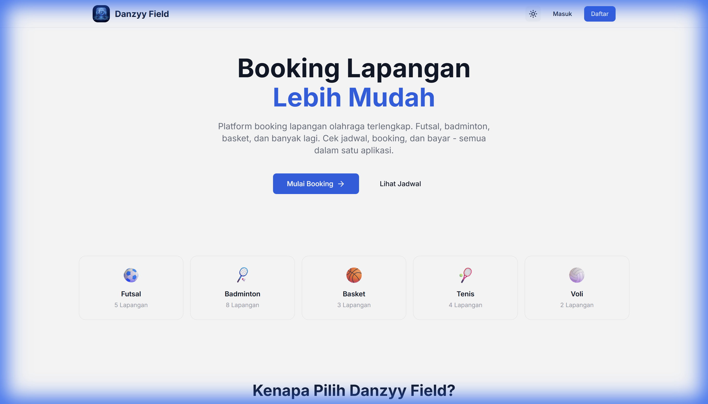
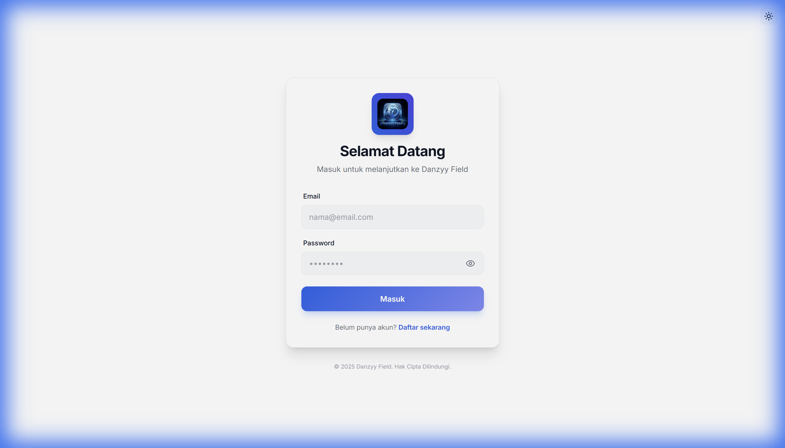
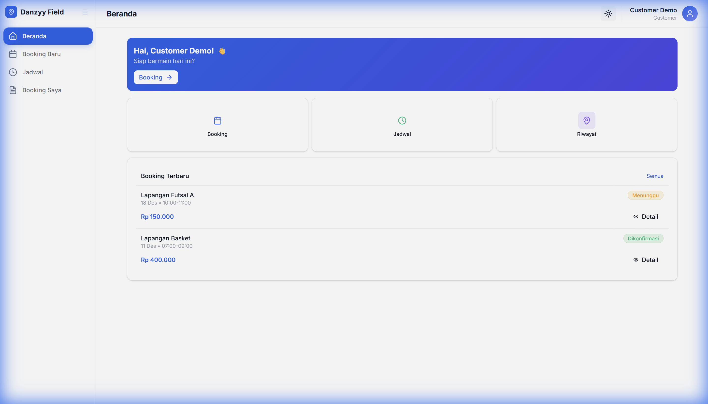
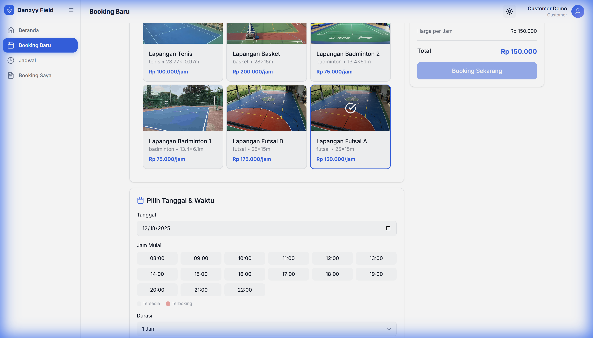
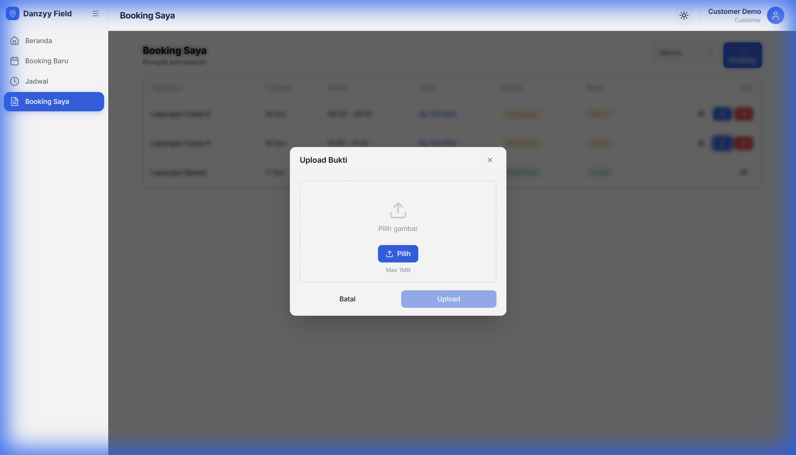
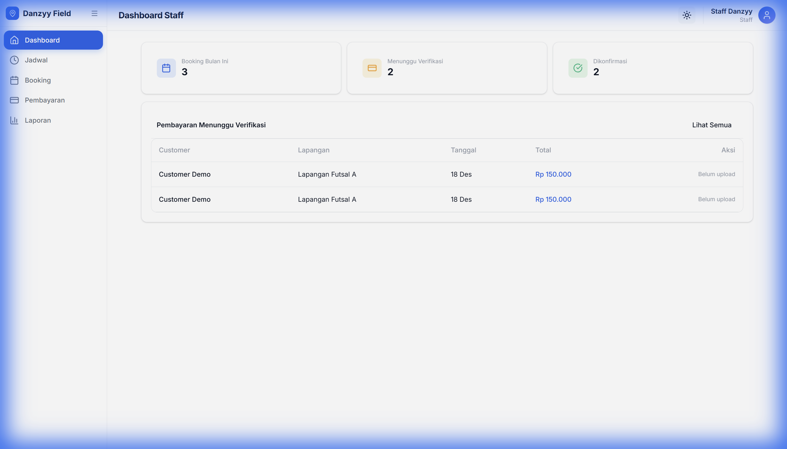
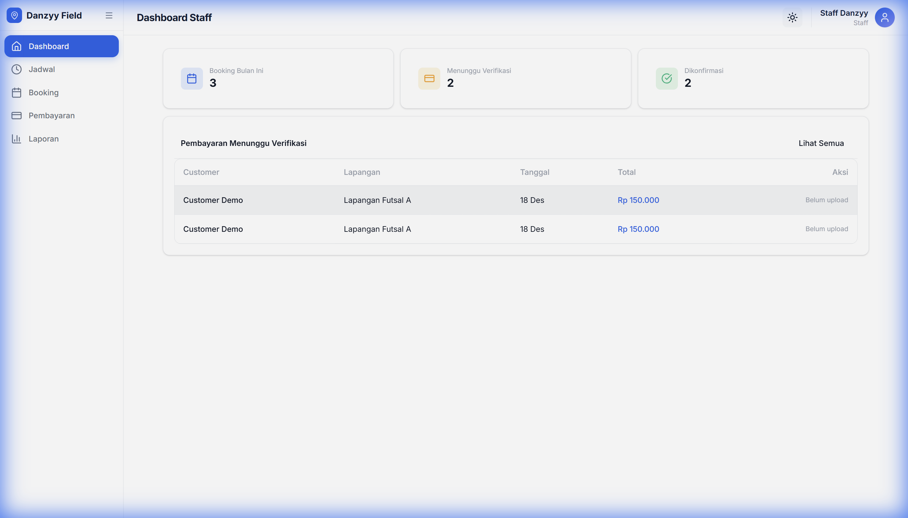
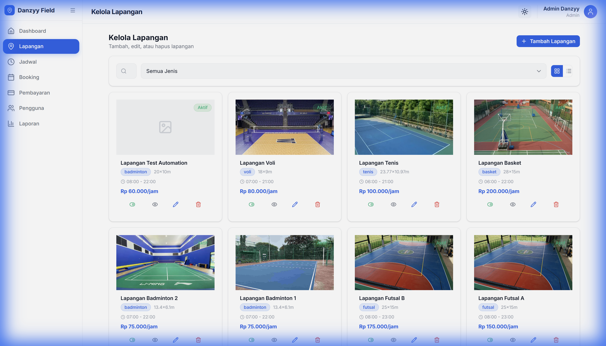
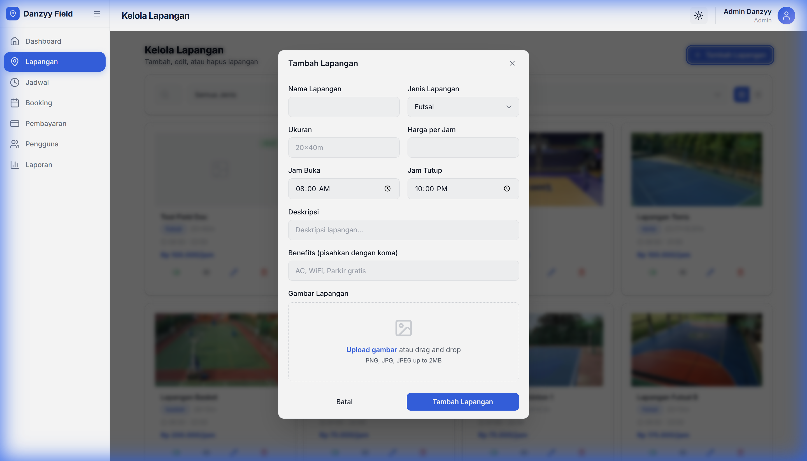
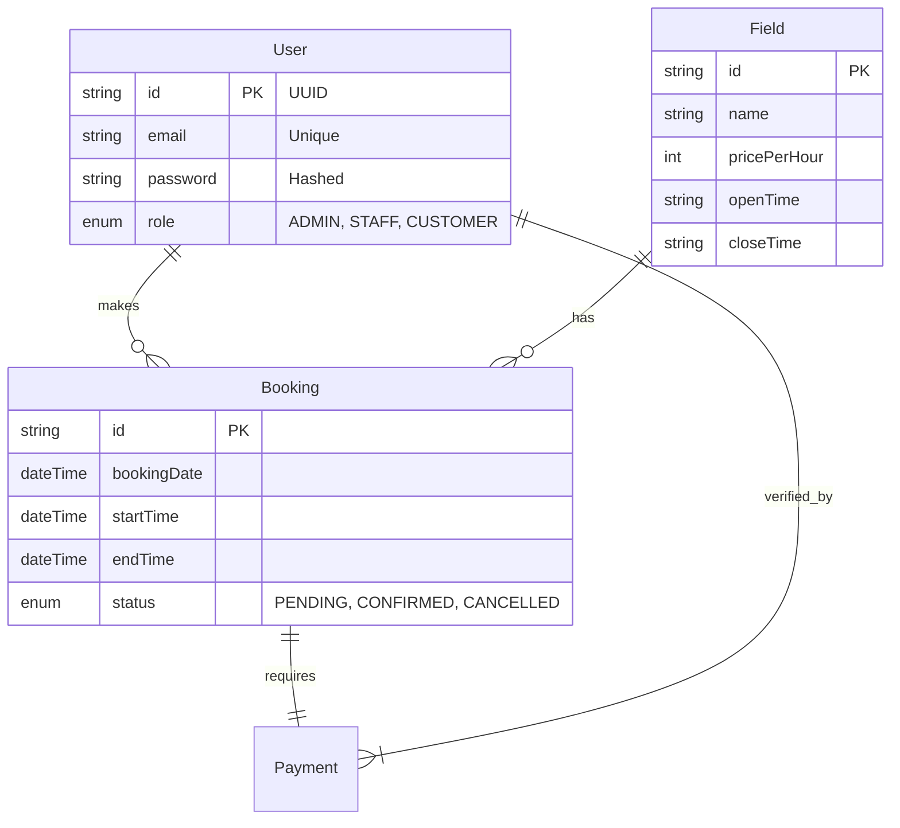

# LAPORAN TUGAS BESAR PEMROGRAMAN WEB II
## DANZYY FIELD - BOOKING LAPANGAN ONLINE

**Disusun Oleh:**
*   **Nama**: [Dani Candra]
*   **Kelas**: [Kelas Anda]
*   **NIM**: [NIM Anda]

---

# KATA PENGANTAR

Puji syukur kehadirat Tuhan Yang Maha Esa atas rahmat dan karunia-Nya, sehingga penulis dapat menyelesaikan tugas besar Pemrograman Web II dengan judul "**Sistem Booking Lapangan Online (Danzyy Field)**". Aplikasi ini dibuat untuk mempermudah proses reservasi lapangan olahraga secara digital.

Penulis menyadari bahwa laporan ini masih jauh dari kesempurnaan. Oleh karena itu, kritik dan saran yang membangun sangat diharapkan untuk perbaikan di masa mendatang.

---

# DAFTAR ISI

1.  **BAB I: PENDAHULUAN**
2.  **BAB II: ANALISIS SISTEM**
3.  **BAB III: IMPLEMENTASI & PANDUAN (USER MANUAL)**
4.  **BAB IV: DATABASE & TEKNIS**
5.  **BAB V: PENUTUP**

---

# BAB I: PENDAHULUAN

## 1.1 Latar Belakang
Dalam penyewaan lapangan olahraga konvensional, pelanggan seringkali kesulitan mengetahui jadwal yang tersedia tanpa datang ke lokasi atau menghubungi admin. Admin juga kesulitan mengelola jadwal secara manual yang berpotensi menyebabkan *double booking*. Oleh karena itu, dibangunlah sistem **Danzyy Field** berbasis web untuk memberikan solusi *real-time* booking.

## 1.2 Tujuan
1.  Memudahkan pelanggan melihat jadwal dan memesan lapangan secara online.
2.  Membantu pengelola (Staff/Admin) memverifikasi pembayaran dan mengatur jadwal.
3.  Memenuhi tugas besar mata kuliah Pemrograman Web II.

---

# BAB II: ANALISIS SISTEM & FITUR

## 2.1 Deskripsi Aplikasi
**Danzyy Field** adalah aplikasi berbasis web yang dibangun menggunakan **Next.js (React)** dan **Prisma ORM**. Aplikasi ini memungkinkan pengguna untuk mencari lapangan, memilih jadwal, dan melakukan pembayaran dengan bukti transfer.

## 2.2 Hak Akses (Role)
Aplikasi ini memiliki 3 Role sesuai persyaratan:
1.  **Administrator**: Memiliki hak akses penuh untuk mengelola data master (Lapangan, User).
2.  **Staff**: Bertugas memvalidasi pembayaran dan melihat jadwal harian.
3.  **Customer**: Pengguna umum yang melakukan pemesanan dan pembayaran.

## 2.3 Pemenuhan Syarat CRUD
Aplikasi ini memenuhi syarat minimal 3 fitur CRUD:
1.  **Fitur Lapangan (Admin)**: Create, Read, Update, Delete data lapangan.
2.  **Fitur Pemesanan (Customer)**: Create (Booking), Read (History).
3.  **Fitur Verifikasi (Staff)**: Read (List Order), Update (Approve/Reject Status).

---

# BAB III: IMPLEMENTASI & PANDUAN PENGGUNAAN

Berikut adalah tampilan antarmuka dan alur penggunaan aplikasi yang telah di-hosting di:  
**URL Demo**: [https://booking-lapangan.vercel.app](https://booking-lapangan.vercel.app)

**Akun Demo:**
*   **Admin**: `admin@danzyy.com` / `admin123`
*   **Staff**: `staff@danzyy.com` / `staff123`
*   **Customer**: `customer@danzyy.com` / `customer123`

## 3.1 Halaman Utama & Autentikasi

*(Gambar 3.1: Halaman Landing Page)*

Pengguna wajib login untuk mengakses fitur utama.

*(Gambar 3.2: Halaman Login)*

## 3.2 Alur Pemesanan (Customer)
**1. Dashboard & Pilih Lapangan**  
Customer melihat daftar lapangan tersedia.

**2. Form Pemesanan**  
Memilih tanggal dan jam sewa.

**3. Pembayaran**  
Upload bukti transfer untuk menyelesaikan pesanan.

## 3.3 Alur Verifikasi (Staff)
Staff memeriksa pesanan masuk di dashboard.

Staff melakukan verifikasi (Approve/Reject).

## 3.4 Manajemen Data (Admin)
Admin dapat mengelola data lapangan (CRUD).

---

# BAB IV: DATABASE & TEKNIS

## 4.1 Desain Database (ERD)
Sistem menggunakan database relasional dengan skema sebagai berikut:

## 4.2 Teknologi yang Digunakan
*   **Frontend Framework**: Next.js 16
*   **Styling**: Tailwind CSS
*   **Backend / API**: Next.js Server Actions
*   **Database**: MySQL (via Prisma ORM)

---

# BAB V: PENUTUP

## 5.1 Kesimpulan
Aplikasi **Danzyy Field** berhasil dibangun dengan fitur utama pendaftaran, pemesanan lapangan, validasi staff, dan manajemen admin. Sistem ini memenuhi seluruh persyaratan tugas besar termasuk implementasi CRUD dan pembagian 3 hak akses pengguna.

## 5.2 Saran
Pengembangan selanjutnya dapat menambahkan fitur notifikasi email otomatis dan integrasi Payment Gateway otomatis (seperti Midtrans) agar verifikasi berjalan instan tanpa perlu staff manual.

---
*Laporan ini dibuat secara otomatis pada tanggal 6 Februari 2025.*
