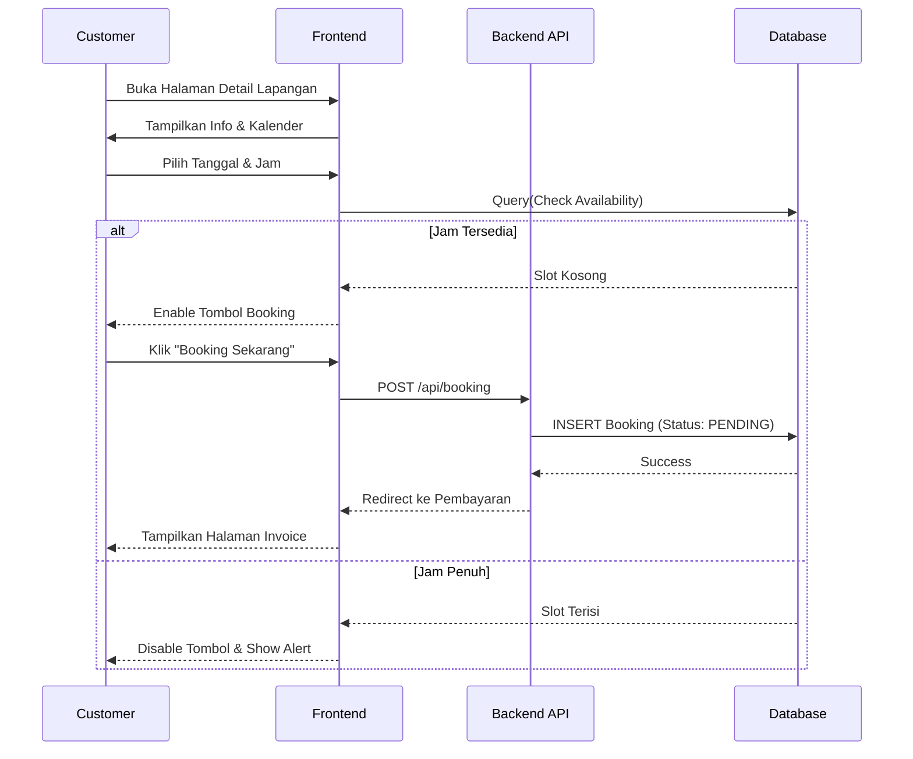
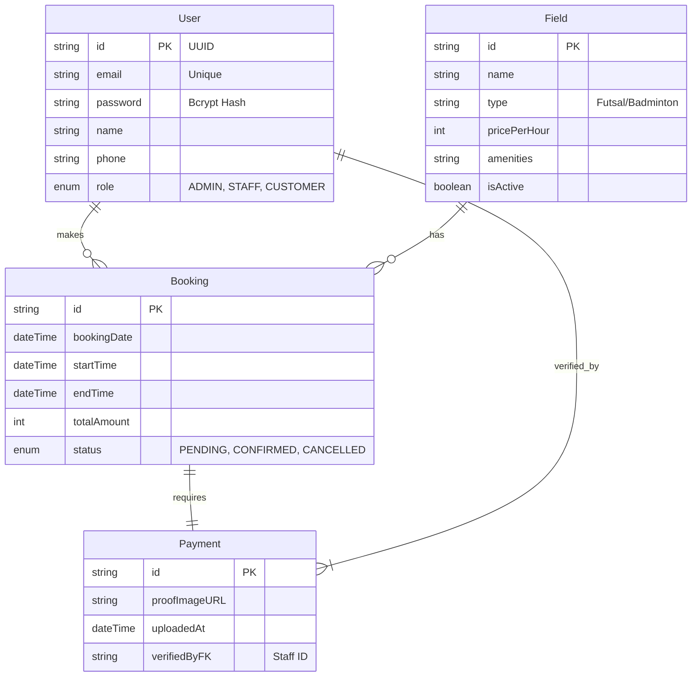
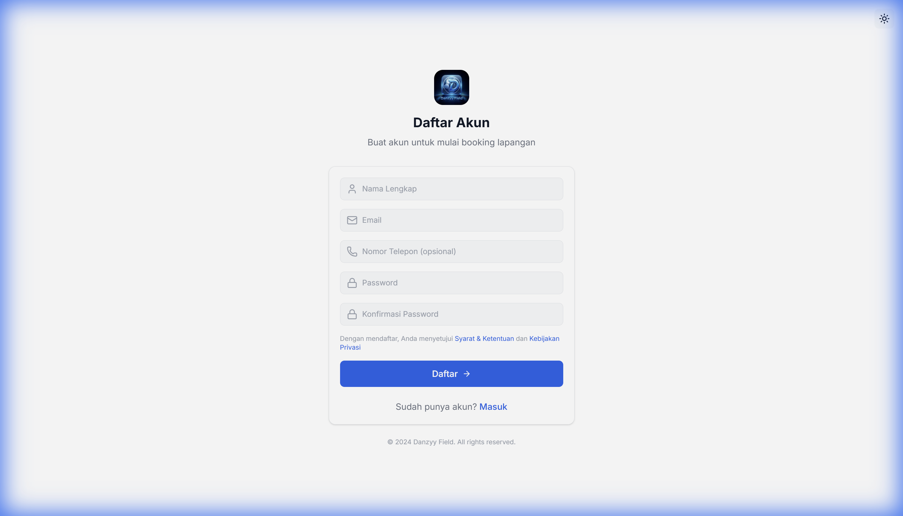
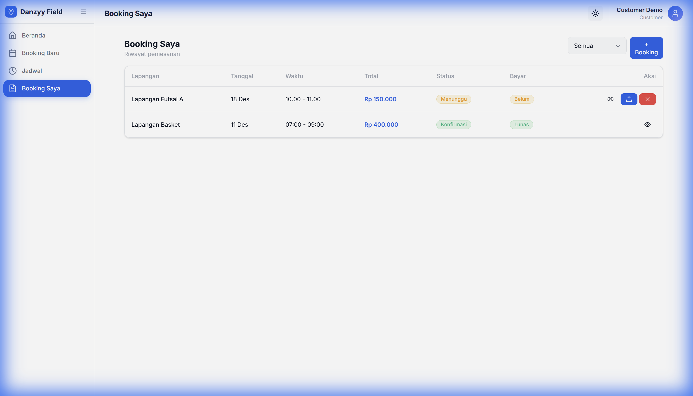
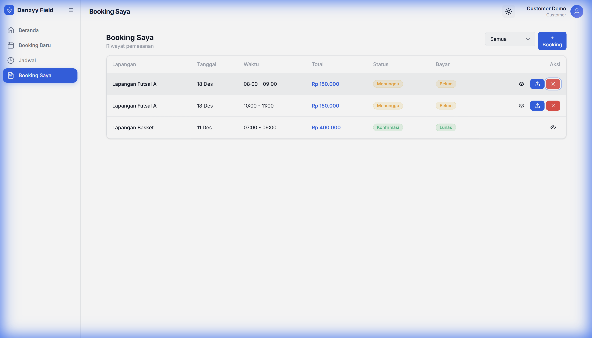
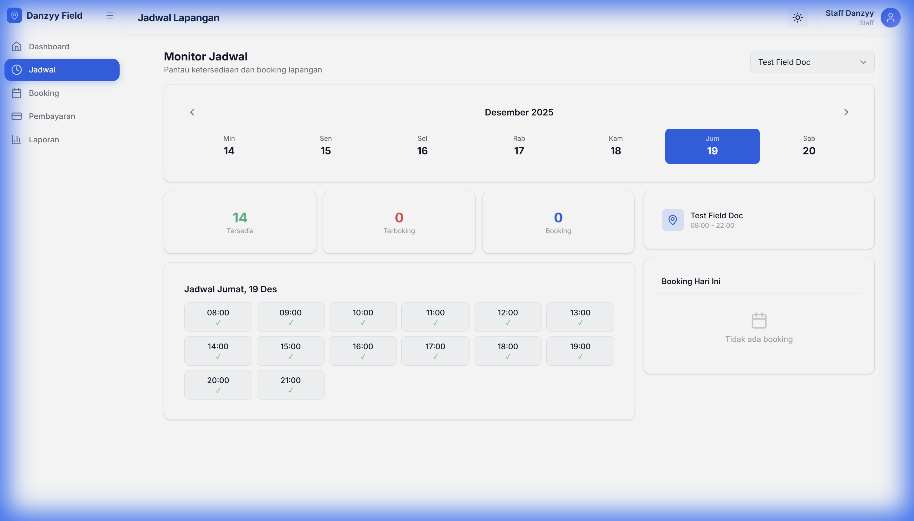
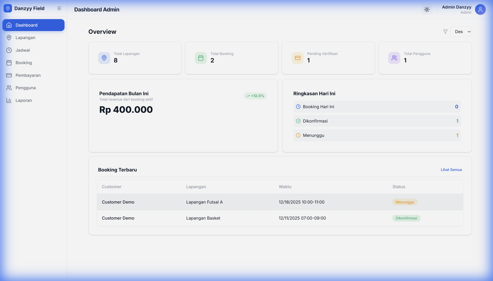
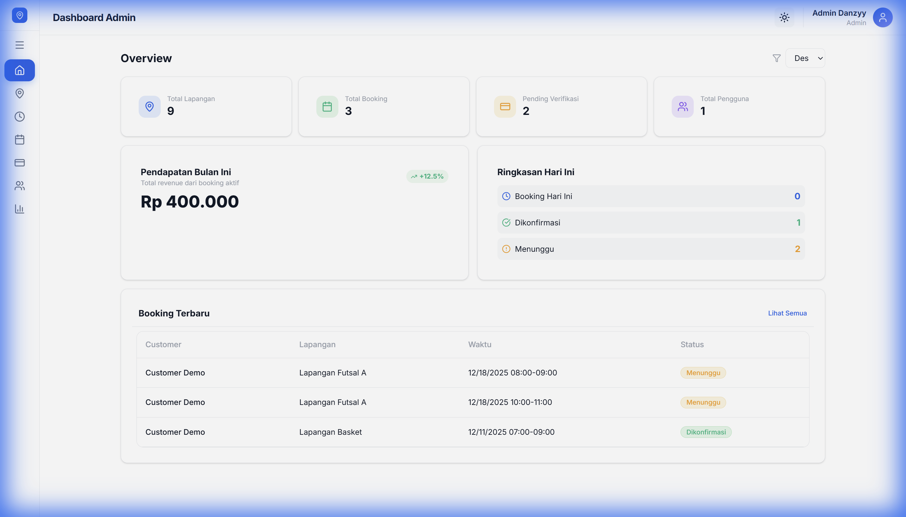
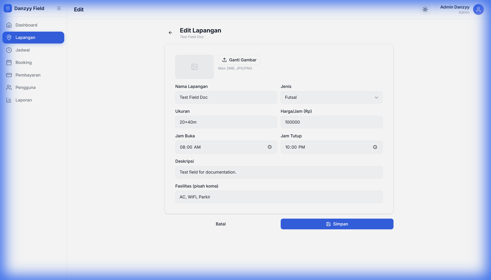
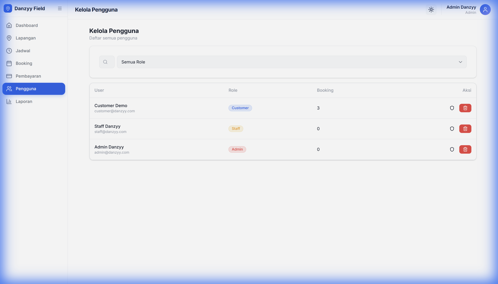

# LAPORAN TUGAS BESAR PEMROGRAMAN WEB II
## RANCANG BANGUN SISTEM INFORMASI BOOKING LAPANGAN ONLINE BERBASIS WEB (E-BOOKING DANZYY FIELD)


**Disusun Oleh:**

| Nama | NIM | Kelas |
| :--- | :--- | :--- |
| **Dani Candra** | [NIM Anda] | [Kelas Anda] |

**Program Studi Teknik Informatika**
**Fakultas Ilmu Komputer**
**[Nama Universitas Anda]**
**2025**

---

# KATA PENGANTAR

Puji syukur kehadirat Tuhan Yang Maha Esa atas segala limpahan rahmat, taufik, dan hidayah-Nya, sehingga penulis dapat menyelesaikan Laporan Tugas Besar ini dengan judul **"Rancang Bangun Sistem Informasi Booking Lapangan Online Berbasis Web (E-Booking Danzyy Field)"**.

Laporan ini disusun sebagai salah satu syarat kelulusan mata kuliah **Pemrograman Web II** pada Program Studi Teknik Informatika di [Nama Universitas Anda]. Tujuan utama dari pembuatan sistem ini adalah untuk mendigitalisasi proses reservasi lapangan olahraga yang selama ini masih dilakukan secara konvensional, sehingga dapat meningkatkan efisiensi waktu bagi pengelola maupun pelanggan.

Penulis menyadari bahwa dalam penyusunan laporan ini tidak lepas dari bimbingan dan dukungan berbagai pihak. Oleh karena itu, penulis ingin mengucapkan terima kasih yang sebesar-besarnya kepada:
1.  Bapak/Ibu Dosen Pengampu mata kuliah Pemrograman Web II yang telah memberikan ilmu dan arahannya.
2.  Rekan-rekan seperjuangan yang telah banyak membantu dalam proses diskusi dan pengerjaan tugas ini.

Penulis menyadari sepenuhnya bahwa laporan ini masih jauh dari kata sempurna dikarenakan keterbatasan, pengalaman, dan pengetahuan yang penulis miliki. Oleh karena itu, penulis mengharapkan segala bentuk saran serta masukan bahkan kritik yang membangun dari berbagai pihak. Akhirnya, penulis berharap semoga laporan ini dapat memberikan manfaat bagi perkembangan dunia pendidikan dan teknologi.

[Kota, Tanggal Bulan 2025]

**Penulis**

---

# DAFTAR ISI

1.  **BAB I: PENDAHULUAN**
    *   1.1 Latar Belakang Masalah
    *   1.2 Identifikasi Masalah
    *   1.3 Rumusan Masalah
    *   1.4 Batasan Masalah
    *   1.5 Tujuan Penulisan
    *   1.6 Manfaat Penulisan
2.  **BAB II: LANDASAN TEORI**
    *   2.1 Konsep Dasar Sistem Informasi
    *   2.2 Next.js Framework (App Router)
    *   2.3 TypeScript Language
    *   2.4 Database Management System (MySQL)
    *   2.5 Object Relational Mapping (Prisma)
    *   2.6 Tailwind CSS Framework
3.  **BAB III: ANALISIS & PERANCANGAN SISTEM**
    *   3.1 Analisis Kebutuhan Sistem
        *   3.1.1 Kebutuhan Fungsional
        *   3.1.2 Kebutuhan Non-Fungsional
    *   3.2 Perancangan Sistem (UML)
        *   3.2.1 Use Case Diagram
        *   3.2.2 Activity Diagram
    *   3.3 Perancangan Database (ERD)
4.  **BAB IV: IMPLEMENTASI & PEMBAHASAN**
    *   4.1 Implementasi Lingkungan Kerja
    *   4.2 Implementasi Antarmuka (User Interface)
        *   4.2.1 Halaman Publik (Landing Page)
        *   4.2.2 Halaman Autentikasi (Login & Register)
        *   4.2.3 Dashboard Customer & Flow Pemesanan
        *   4.2.4 Dashboard Staff & Flow Verifikasi
        *   4.2.5 Dashboard Admin & Manajemen Data
    *   4.3 Pengujian Sistem (Black Box Testing)
5.  **BAB V: PENUTUP**
    *   5.1 Kesimpulan
    *   5.2 Saran

---

# BAB I
# PENDAHULUAN

## 1.1 Latar Belakang Masalah
Perkembangan teknologi informasi yang sangat pesat saat ini telah merambah ke berbagai aspek kehidupan manusia, termasuk dalam bidang bisnis penyewaan sarana olahraga. Penggunaan teknologi komputer sebagai alat bantu pengolahan data menjadi suatu kebutuhan yang tidak dapat dihindari untuk meningkatkan efisiensi dan efektivitas kerja.

Pada objek penelitian ini, yaitu penyewaan Lapangan Futsal dan Badminton, proses reservasi saat ini masih dilakukan secara manual. Pelanggan harus datang langsung ke lokasi atau menghubungi melalui telepon/WhatsApp untuk menanyakan ketersediaan jadwal. Admin pencatat harus membuka buku besar jadwal untuk mengecek slot kosong. Proses ini memakan waktu, rentan terjadi kesalahan pencatatan (*human error*), dan berpotensi menyebabkan jadwal ganda (*double booking*) yang merugikan pelanggan.

Selain itu, rekapitulasi laporan keuangan bulanan seringkali mengalami selisih karena bukti pembayaran yang tercecer atau tidak terarsip dengan baik. Oleh karena itu, diperlukan sebuah solusi berupa Sistem Informasi Booking Lapangan Online berbasis web yang dapat diakses kapan saja dan di mana saja, yang mampu mengelola jadwal secara *real-time* dan memvalidasi pembayaran secara sistematis.

## 1.2 Rumusan Masalah
Berdasarkan latar belakang di atas, rumusan masalah dalam penelitian ini adalah:
1.  Bagaimana merancang sistem informasi reservasi lapangan yang dapat meminimalkan kesalahan jadwal ganda (*double booking*)?
2.  Bagaimana mempermudah pelanggan dalam melihat jadwal kosong tanpa harus datang ke lokasi?
3.  Bagaimana membantu pengelola dalam merekapitulasi laporan pendapatan bulanan secara otomatis?

## 1.3 Batasan Masalah
Agar pembahasan lebih terarah, penulis membatasi masalah sebagai berikut:
1.  Aplikasi dibangun berbasis Web menggunakan Framework Next.js.
2.  Sistem mencakup 3 hak akses (Role): Admin, Staff, dan Customer.
3.  Metode pembayaran dilakukan melalui transfer bank manual dengan fitur upload bukti bayar.
4.  Fitur utama meliputi: Manajemen Data Lapangan, Booking Online, Verifikasi Pembayaran, dan Laporan Keuangan sederhana.

## 1.4 Tujuan Penulisan
Tujuan dari pembuatan sistem ini adalah:
1.  Menghasilkan aplikasi web booking lapangan yang responsif dan mudah digunakan (*user friendly*).
2.  Mengimplementasikan minimal 3 fungsi CRUD *Create, Read, Update, Delete* pada 3 entitas berbeda.
3.  Memenuhi tugas besar mata kuliah Pemrograman Web II.

## 1.5 Manfaat Penulisan
1.  **Bagi Penulis**: Menambah wawasan dan pengalaman dalam mengimplementasikan ilmu pemrograman web modern.
2.  **Bagi Pengelola**: Mempermudah manajemen jadwal dan keuangan usaha.
3.  **Bagi Pelanggan**: Memberikan kemudahan dan kepastian dalam memesan lapangan olahraga.

---

# BAB II
# LANDASAN TEORI

## 2.1 Konsep Dasar Sistem Informasi
Sistem informasi adalah kombinasi dari teknologi informasi dan aktivitas orang yang menggunakan teknologi itu untuk mendukung operasi dan manajemen. Dalam arti yang sangat luas, istilah sistem informasi yang sering digunakan merujuk kepada interaksi antara orang, proses algoritmik, data, dan teknologi.

## 2.2 Next.js Framework (App Router)
**Next.js** adalah framework React yang dikembangkan oleh Vercel. Versi terbaru (Next.js 14/15/16) menggunakan arsitektur **App Router** yang mendukung *React Server Components* (RSC). Fitur ini memungkinkan komponen dirender di sisi server, meningkatkan performa awal (*First Contentful Paint*) dan SEO (*Search Engine Optimization*) dibandingkan dengan *Single Page Application* (SPA) biasa.

## 2.3 TypeScript Language
**TypeScript** adalah superset dari JavaScript yang menambahkan fitur *static typing*. Dengan TypeScript, pengembang dapat mendeteksi kesalahan tipe data (*type errors*) pada saat kompilasi (coding), bukan saat aplikasi dijalankan (*runtime*), sehingga kode menjadi lebih robust dan mudah dipelihara.

## 2.4 Database Management System (MySQL)
**MySQL** adalah sebuah perangkat lunak sistem manajemen basis data SQL (*DBMS*) yang *multithread* dan *multi-user*. MySQL digunakan karena kinerjanya yang cepat, handal, dan mudah digunakan. Dalam proyek ini, MySQL berfungsi untuk menyimpan data pengguna, data lapangan, data pesanan (booking), dan data transaksi pembayaran.

## 2.5 Object Relational Mapping (Prisma)
**Prisma** adalah ORM (*Object-Relational Mapping*) generasi baru untuk Node.js dan TypeScript. Prisma memudahkan interaksi dengan database dengan menyediakan API yang *type-safe* dan *auto-generated*. Pengembang tidak perlu menulis query SQL mentah, melainkan menggunakan metode seperti `prisma.user.findMany()` yang lebih aman dan intuitif.

## 2.6 Tailwind CSS Framework
**Tailwind CSS** adalah framework CSS yang mengutamakan utilitas (*utility-first*). Berbeda dengan Bootstrap yang menyediakan komponen UI siap pakai, Tailwind menyediakan kelas-kelas utilitas tingkat rendah seperti `flex`, `pt-4`, `text-center`, dan `rotate-90`. Pendekatan ini memberikan fleksibilitas desain yang tak terbatas tanpa harus meninggalkan file HTML/JSX.

---

# BAB III
# ANALISIS & PERANCANGAN SISTEM

## 3.1 Analisis Kebutuhan Sistem
Tahap analisis kebutuhan dilakukan untuk mengetahui fitur apa saja yang harus tersedia dalam aplikasi **Danzyy Field**.

### 3.1.1 Kebutuhan Fungsional
1.  **Pengguna (Customer)**
    *   Dapat melakukan registrasi dan login.
    *   Dapat melihat daftar lapangan beserta fasilitas dan harga.
    *   Dapat memilih tanggal dan jam sewa yang tersedia.
    *   Dapat mengunggah bukti pembayaran untuk pesanan yang dibuat.
    *   Dapat melihat riwayat pesanan dan status verifikasi.
2.  **Staff Operasional**
    *   Dapat melihat daftar pesanan baru yang masuk.
    *   Dapat memverifikasi bukti pembayaran (Approve/Reject).
    *   Dapat melihat jadwal harian lapangan secara visual.
3.  **Administrator**
    *   Memiliki akses penuh ke seluruh fitur sistem.
    *   Dapat menambah, mengubah, dan menghapus data lapangan (CRUD Field).
    *   Dapat melihat dan menghapus data pengguna (CRUD User).
    *   Dapat melihat dashboard statistik pendapatan.

### 3.1.2 Kebutuhan Non-Fungsional
1.  **Availability**: Sistem harus dapat diakses 24 jam sehari.
2.  **Reliability**: Sistem tidak boleh mengizinkan dua orang membooking jam yang sama (Double Booking Prevention).
3.  **Security**: Password pengguna harus dienkripsi (Hashing) dan akses halaman harus dibatasi berdasarkan Role (Middleware Protection).

## 3.2 Perancangan Sistem (UML)

### 3.2.1 Use Case Diagram
Diagram Use Case menggambarkan interaksi antara aktor (pengguna) dengan sistem.

```mermaid
usecaseDiagram
    actor Customer
    actor Staff
    actor Admin

    package Sistem_Booking {
        usecase "Login / Register" as UC1
        usecase "Melihat & Mencari Lapangan" as UC2
        usecase "Membuat Pesanan (Booking)" as UC3
        usecase "Upload Bukti Bayar" as UC4
        usecase "Melihat Riwayat Transaksi" as UC_Hist
        usecase "Verifikasi Pembayaran" as UC5
        usecase "Lihat Jadwal Harian" as UC9
        usecase "Kelola Data Lapangan (CRUD)" as UC6
        usecase "Kelola Data Pengguna" as UC7
        usecase "Lihat Laporan & Statistik" as UC8
    }

    Customer --> UC1
    Customer --> UC2
    Customer --> UC3
    Customer --> UC4
    Customer --> UC_Hist

    Staff --> UC1
    Staff --> UC5
    Staff --> UC9

    Admin --> UC1
    Admin --> UC6
    Admin --> UC7
    Admin --> UC8
```

### 3.2.2 Activity Diagram (Alur Booking)
Flowchart berikut menjelaskan logika sistem saat Customer melakukan pemesanan.



## 3.3 Perancangan Database (ERD)
Perancangan struktur database menggunakan Normalisasi Tingkat 3 (3NF) untuk menghindari redundansi data.

### Entitas Utama
1.  **User**: Menyimpan data akun login (Admin, Staff, Customer).
2.  **Field**: Menyimpan data master lapangan (Nama, Tipe, Harga, Fasilitas).
3.  **Booking**: Menyimpan transaksi pemesanan (Tanggal, Jam Mulai, Jam Selesai, Total Harga).
4.  **Payment**: Menyimpan bukti transfer dan detail pembayaran.



---

# BAB IV
# IMPLEMENTASI & PEMBAHASAN

Bab ini membahas realisasi dari rancangan sistem yang telah dibuat, beserta penjelasan detil dari setiap antarmuka yang dihasilkan.

## 4.1 Implementasi Antarmuka (User Interface)

### 4.1.1 Halaman Publik (Landing Page)
Halaman ini adalah gerbang utama aplikasi. Terdapat *Hero Section* dengan tombol "Booking Sekarang" yang mengajak pengguna untuk segera memesan. Navigasi bar di atas memudahkan akses ke Login atau Daftar.

*Gambar 4.1: Tampilan Landing Page yang Responsif dan Estetis.*

### 4.1.2 Halaman Autentikasi
Keamanan adalah prioritas. Halaman login dan register didesain simpel namun fungsional dengan validasi input.

*Gambar 4.2: Form Registrasi Akun Baru.*


*Gambar 4.3: Form Login Pengguna.*

### 4.1.3 Dashboard Customer & Flow Pemesanan
Setelah login, Customer diarahkan ke Dashboard. Di sini ditampilkan kartu-kartu lapangan yang tersedia.

*Gambar 4.4: Dashboard Customer menampilkan daftar lapangan.*

Saat memilih lapangan, customer dihadapkan pada **Formulir Booking**. Sistem secara otomatis memblokir jam yang sudah dipesan orang lain.

*Gambar 4.5: Pemilihan Tanggal dan Jam Sewa.*

Setelah booking tersimpan, Customer harus melakukan pembayaran dan mengunggah bukti transfer.

*Gambar 4.6: Halaman Upload Bukti Transfer.*

Customer dapat memantau status pesanan mereka pada menu **Riwayat Pesanan**. Status akan berubah dari *Pending* -> *Confirmed* setelah disetujui staff.


*Gambar 4.7: Daftar Riwayat Pesanan Customer.*

### 4.1.4 Dashboard Staff & Flow Verifikasi
Staff memiliki tugas khusus yaitu memvalidasi pembayaran. Dashboard staff langsung menampilkan daftar antrian booking yang menunggu konfirmasi.

*Gambar 4.8: Dashboard Staff - List Antrian.*

Dengan mengklik tombol "View", Staff dapat melihat detail pesanan dan foto bukti transfer. Staff kemudian memilih tombol **Approve** atau **Reject**.

*Gambar 4.9: Detail Modal Verifikasi Pembayaran.*

Staff juga memiliki menu **Jadwal** untuk melihat visualisasi penggunaan lapangan hari ini, sehingga staff di lokasi dapat mengetahui siapa yang akan bermain jam berapa.

*Gambar 4.10: Tampilan Visual Jadwal Lapangan.*

### 4.1.5 Dashboard Admin & Manajemen Data
Admin adalah *Super User*. Dashboard admin memberikan overview performa bisnis seperti total pendapatan dan jumlah user baru.


*Gambar 4.11: Dashboard Administrator dengan Statistik.*

**Manajemen Data Lapangan (CRUD)**: Admin dapat menambahkan lapangan baru dengan detail fasilitas dan harga per jam.

*Gambar 4.12: Daftar Manajemen Lapangan.*



*Gambar 4.13: Form Tambah Data Lapangan Baru.*

**Manajemen Pengguna**: Admin dapat melihat siapa saja yang mendaftar di sistem dan menghapus akun spam jika diperlukan.

*Gambar 4.14: Daftar Pengguna Terdaftar dalam Sistem.*

**Laporan Keuangan**: Fitur report sederhana untuk melihat rekapitulasi booking yang berhasil dan total omset.

*Gambar 4.15: Laporan Pendapatan Sistem.*

## 4.3 Pengujian Sistem (Black Box Testing)
Pengujian Black Box dilakukan untuk memastikan fungsionalitas sistem berjalan sesuai input dan output yang diharapkan tanpa melihat kode internal.

| No | Skenario Pengujian | Langkah Pengujian | Hasil yang Diharapkan | Hasil Nyata | Kesimpulan |
| :--- | :--- | :--- | :--- | :--- | :--- |
| 1 | **Login Valid** | Masukan Email & Password benar, Klik Login | Masuk ke Dashboard sesuai Role | Masuk ke Dashboard | **Valid** |
| 2 | **Login Invalid** | Masukan Password salah | Muncul pesan "Password Salah" | Muncul Alert Error | **Valid** |
| 3 | **Booking Bentrok** | Pilih jam yang sudah dibooking User A | Sistem menolak booking User B | Tombol Disable / Alert | **Valid** |
| 4 | **Upload Gambar** | Upload file .png / .jpg | Gambar terpreview dan tersimpan | Gambar muncul | **Valid** |
| 5 | **Verifikasi Staff** | Klik Approve pada Order | Status berubah jadi Confirmed | Status Confirmed | **Valid** |
| 6 | **CRUD Lapangan** | Tambah lapangan, Edit Harga, Hapus | Data berubah di database | Data terupdate | **Valid** |
| 7 | **Proteksi Halaman**| Akses URL `/admin` tanpa login | Redirect ke Login | Redirect Login | **Valid** |

---

# BAB V
# PENUTUP

## 5.1 Kesimpulan
Berdasarkan seluruh tahapan mulai dari analisis, perancangan, implementasi, hingga pengujian yang telah dilakukan, penulis menarik kesimpulan sebagai berikut:
1.  Aplikasi **Danzyy Field** berhasil dirancang bangun menggunakan teknologi web modern (Next.js & Prisma) yang menghasilkan performa cepat dan responsif.
2.  Masalah pencatatan manual dan *double booking* berhasil diatasi dengan sistem validasi jadwal otomatis oleh database.
3.  Sistem berhasil mengimplementasikan 3 peran pengguna (Admin, Staff, Customer) dengan hak akses yang terisolasi dengan baik.
4.  Fitur rekapitulasi laporan pada dashboard Admin memudahkan pemilik usaha memantau pendapatan secara transparan.

## 5.2 Saran Pengembangan
Sistem ini masih memiliki ruang untuk pengembangan lebih lanjut agar menjadi lebih sempurna. Beberapa saran yang dapat penulis berikan untuk pengembangan selanjutnya adalah:
1.  **Integrasi Payment Gateway**: Menghubungkan sistem dengan Midtrans atau Xendit agar pembayaran dapat diverifikasi secara otomatis tanpa perlu persetujuan manual Staff.
2.  **Notifikasi WhatsApp**: Mengirimkan pesan konfirmasi booking dan pengingat jadwal bermain ke WhatsApp pelanggan secara otomatis.
3.  **Fitur Member & Diskon**: Menambahkan sistem keanggotaan (Membership) dengan harga khusus untuk pelanggan setia.
4.  **Aplikasi Mobile**: Mengembangkan versi aplikasi mobile (Android/iOS) menggunakan React Native untuk kemudahan akses yang lebih baik.

---

**DAFTAR PUSTAKA**

1.  *Documentation Next.js*. (2024). Vercel Inc. https://nextjs.org/docs
2.  *Prisma ORM Documentation*. (2024). Prisma Data. https://www.prisma.io/docs
3.  *Tailwind CSS Documentation*. (2024). Tailwind Labs. https://tailwindcss.com/docs
4.  Rosa A.S., & Shalahuddin, M. (2018). *Rekayasa Perangkat Lunak Terstruktur dan Berorientasi Objek*. Informatika Bandung.

---
*Laporan Tugas Besar Pemrograman Web II - 2025*
