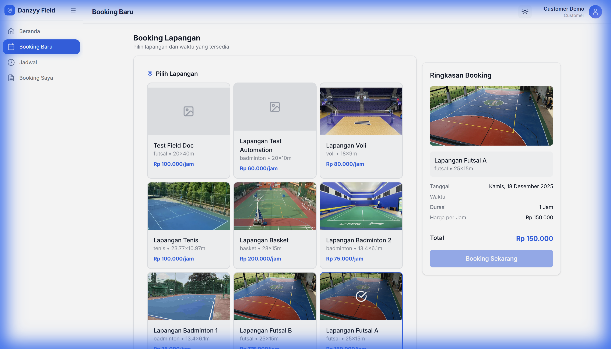
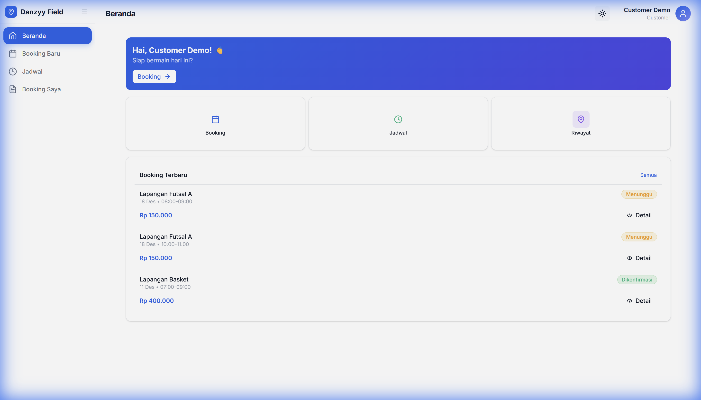
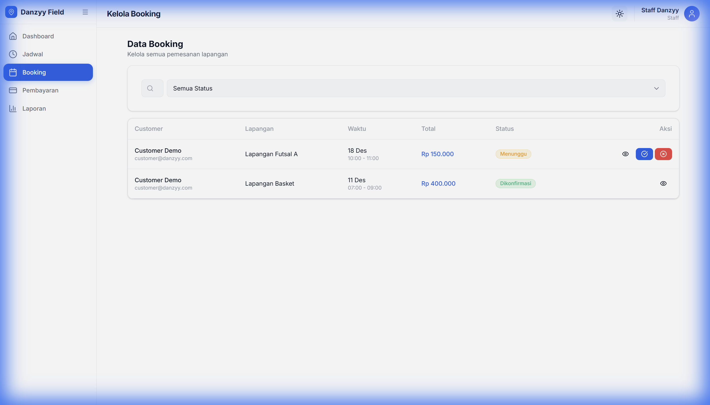
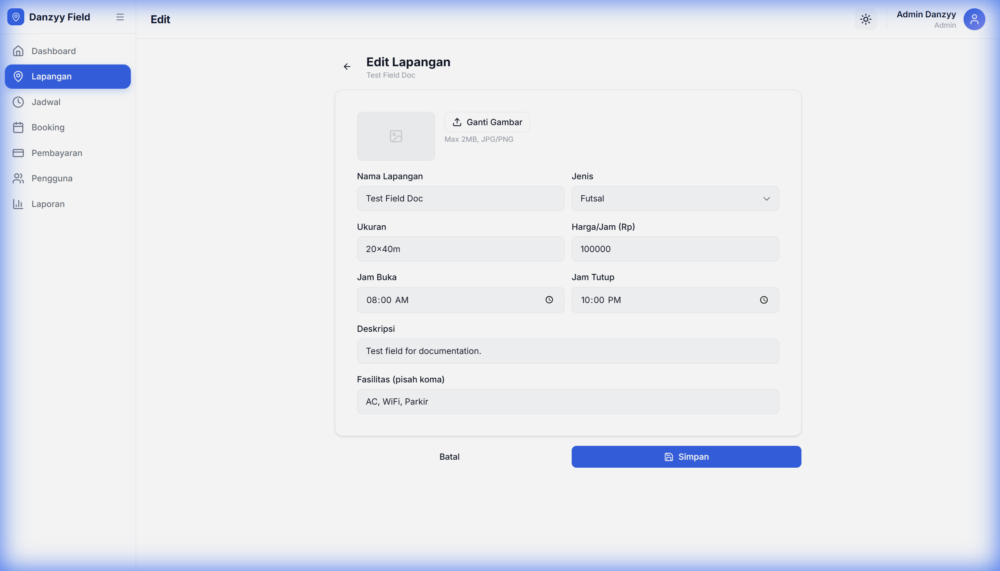
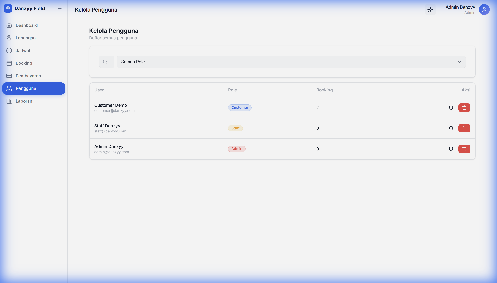

# Panduan Penggunaan Sistem Booking Lapangan (User Manual)

Selamat datang di **Danzyy Field**, platform pemesanan lapangan futsal yang mudah dan cepat. Dokumen ini adalah panduan lengkap untuk penggunaan sistem, termasuk informasi teknis untuk kebutuhan laporan.

---

## 1. Informasi Sistem & Akses Demo

Berikut adalah informasi akses website yang sudah di-hosting beserta akun demo yang dapat digunakan untuk pengujian (3 Role).

### Link Website
**URL**: [https://booking-lapangan.vercel.app](https://booking-lapangan.vercel.app)

### Akun Demo (Credentials)
Gunakan akun berikut untuk mencoba fitur di masing-masing role:

| Role | Email | Password | Fitur Utama |
| :--- | :--- | :--- | :--- |
| **Administrator** | `admin@danzyy.com` | `admin123` | CRUD Lapangan, User Management, Full Access |
| **Staff** | `staff@danzyy.com` | `staff123` | Validasi Pembayaran, Cek Jadwal (Read/Update) |
| **Customer** | `customer@danzyy.com` | `customer123` | Booking Lapangan (Create), Upload Bukti, History |

---

## 2. Fitur Utama & CRUD
Sistem ini memenuhi persyaratan minimal 3 CRUD pada 3 fitur berbeda:

1.  **Manajemen Lapangan (Admin)**:
    *   **Create**: Menambah lapangan baru.
    *   **Read**: Melihat daftar harga dan fasilitas.
    *   **Update**: Mengubah harga atau detail lapangan.
    *   **Delete**: Menghapus lapangan non-aktif.
2.  **Pemesanan / Booking (Customer & Staff)**:
    *   **Create**: Customer membuat pesanan baru.
    *   **Read**: Staff mengecek daftar pesanan masuk.
    *   **Update**: Staff memverifikasi pembayaran (Pending -> Confirmed).
3.  **Manajemen User (Admin)**:
    *   **Read**: Melihat daftar pengguna terdaftar.
    *   **Delete**: Menghapus pengguna yang tidak valid.

---

## 3. Akses & Pendaftaran

Setiap pengguna memulai dari halaman utama sistem ini.

### Halaman Utama (Landing Page)
Saat pertama kali membuka website, Anda akan disambut dengan halaman utama yang menampilkan informasi singkat tentang layanan kami.

### Masuk ke Sistem (Login)
Klik tombol **Masuk** pada pojok kanan atas. Masukkan email dan password Anda untuk masuk.

### Pendaftaran Akun Baru (Register)
Jika Anda belum memiliki akun, klik **Daftar** pada halaman login. Isi data diri Anda dengan lengkap untuk mulai memesan.

---

## 2. Panduan Pelanggan (Customer)

Bagian ini menjelaskan alur lengkap pemesanan lapangan, mulai dari memilih jadwal hingga pembayaran.

### Langkah 1: Melihat Daftar Lapangan
Setelah login, Anda akan masuk ke **Dashboard Customer**. Di sini terlihat daftar lapangan yang tersedia beserta harga per jam.

### Langkah 2: Detail & Jadwal
Pilih salah satu lapangan untuk melihat fasilitas lengkap dan ketersediaan jadwal. Klik tombol **Booking Sekarang** untuk melanjutkan.

### Langkah 3: Mengisi Formulir Pemesanan
Pada halaman ini, pilih **Tanggal** dan **Jam Mulai-Selesai** yang Anda inginkan. Sistem akan otomatis menghitung total harga sewa.

### Langkah 4: Booking Berhasil (Pending)
Setelah menekan tombol submit, pesanan Anda tercatat dengan status **PENDING** (Menunggu Pembayaran).

### Langkah 5: Pembayaran & Upload Bukti
Klik tombol **Bayar Sekarang**. Anda akan melihat instruksi transfer. Setelah transfer, unggah foto bukti pembayaran pada kolom yang disediakan.

### Langkah 6: Menunggu Verifikasi
Pesanan Anda kini menunggu verifikasi staff. Anda bisa memantau statusnya di menu **Riwayat Pesanan** (My Bookings).

### Profil Pengguna
Anda dapat melihat informasi akun Anda pada menu profil di pojok kanan atas.

---

## 3. Panduan Staff (Operasional)

Staff bertugas memverifikasi pembayaran masuk agar jadwal terkunci untuk pelanggan.

### Dashboard Staff
Halaman utama staff menampilkan antrian pesanan yang perlu diproses. Perhatikan status **PENDING** atau **PAID** (sudah upload bukti).

### Proses Verifikasi
Klik pada salah satu pesanan untuk melihat detail.
1. Cek bukti transfer yang diunggah pelanggan.
2. Jika valid, klik **Approve (Terima)**. Status berubah menjadi **CONFIRMED**.
3. Jika tidak valid, klik **Reject (Tolak)**.

### Jadwal Lapangan
Staff dapat melihat kalender jadwal lapangan untuk memastikan tidak ada bentrokan manual.

---

## 4. Panduan Administrator

Administrator memiliki akses penuh untuk mengelola data master aplikasi.

### Admin Dashboard
Ringkasan performa bisnis: total pendapatan, jumlah booking, dan pengguna baru.

### Manajemen Lapangan
Admin dapat menambah atau mengubah data lapangan.
*   **Daftar Lapangan**: Melihat semua lapangan yang terdaftar.
    
*   **Tambah Lapangan**: Form untuk memasukkan lapangan baru.
    
*   **Edit Lapangan**: Mengubah harga atau fasilitas lapangan yang sudah ada.
    

### Manajemen Pengguna
Melihat daftar seluruh pengguna yang terdaftar di sistem (Customer & Staff).

---
*Manual ini diperbarui pada 2025-02-06. Silakan convert file ini ke DOCX.*
